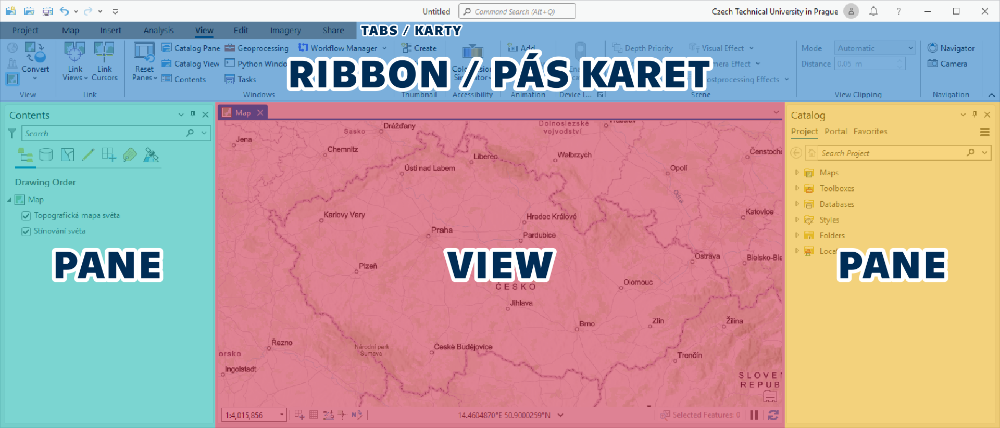

# Úvod do práce v prostředí ArcGIS, datové formáty, geodatabáze

---

## Cíl cvičení

---

## Základní pojmy

---

## Použité datové podklady

---

## Náplň cvičení
### Software pro výuku
Během většiny výuky bude používán program **ArcGIS Pro** – pokročilý desktopový geografický informační systém (GIS) vyvinutý společností **Esri**. Umožňuje uživatelům **vytvářet**, **editovat**, **analyzovat** a **vizualizovat** prostorová data v různých vrstvách, včetně **rastrových** a **vektorových** map, **ortofotomap**, **digitálního výškového modelu** a dalších datasetů.  
Uživatelé mohou vytvářet a upravovat **atributy** a **geometrii** prvků, provádět pokročilé **analýzy**, vytvářet a **publikovat mapové vrstvy** a vytvářet **interaktivní mapové aplikace**. Program obsahuje také nástroje pro **vizualizaci** dat, tvorbu mapových prezentací a **sdílení výsledků** s ostatními uživateli.  

???+ note "&nbsp;Pozn."
      Vzhledem k vysokým pořizovacím nákladům se systém ArcGIS využívá především ve velkých firmách a orgánech státní správy. V menších podnicích je rozšířenější jeho open source alternativa QGIS (tomu bude věnována pozornost v závěru kurzu).

---

### Spuštění a základní orientace v programu
Při spuštění probíhá ověření licence přes příslušnost k organizaci (ČVUT v Praze) – pomocí přihlášení k univerzitnímu účtu. Adresa (URL) pro ČVUT je *ctuprague.maps.arcgis.com* – poté proběhne automatické přesměrování na stránku s univerzitním přihlášením (ve formátu *username@cvut.cz* a heslo to KOSu).

<iframe width="560" height="315" src="https://www.youtube.com/embed/8nDVpVmxM-0" title="YouTube video player" frameborder="0" allow="accelerometer; autoplay; clipboard-write; encrypted-media; gyroscope; picture-in-picture; web-share" allowfullscreen></iframe>

 

{:align=center}

<table style="width: 100%;">
  <tbody>
    <tr>
      <td markdown><strong>RIBBON</strong></td>
      <td>nabídka funkcí programu (prvek shodný s jinými programy, např. Microsoft Word), nabídka se kontextově mění podle akcí uživatele</td>
    </tr>
    <tr>
      <td><strong>VIEW</strong></td>
      <td>okno s mapou (2D) nebo scénou (3D)</td>
    </tr>
    <tr>
      <td><strong>PANE</strong></td>
      <td>panely a vlastnosti funkcí, mnoho funkcí spouští svůj Pane, přes který se daná funkce ovládá, např. Obsah mapy (Contents), Symbologie</td>
    </tr>
  </tbody>
</table>

{ style="height:150px;"}&nbsp;&nbsp;&nbsp;&nbsp;&nbsp;&nbsp;
{ style="height:150px;"}
{: style="margin-bottom:0px;" align=center }
<figcaption>Všechny VIEWs a PANEs jsou dokovatelné – je možné je libovolně přemisťovat po obrazovce a přichytávat k ostatním prvkům</figcaption>

Všechny zmíněné prvky grafického prostředí lze přenastavit. Přidávat/přemisťovat/mazat karty, ikony nástrojů nebo měnit umístění _Views_ a _Panes_.

 

Další zdroje:

[:material-open-in-new: pro.arcgis.com Introduction to ArcGIS Pro](https://pro.arcgis.com/en/pro-app/latest/get-started/get-started.htm){ .md-button .md-button--primary .url-name target="_blank"}&nbsp;&nbsp;&nbsp;&nbsp;&nbsp;&nbsp;
[:material-open-in-new: pro.arcgis.com Introducing ArcGIS Pro](https://pro.arcgis.com/en/pro-app/latest/get-started/introducing-arcgis-pro.htm){ .md-button .md-button--primary .url-name target="_blank"}
{: align=center }

---

### Přidání dat do mapy (Catalog Pane)

<table style="border: 0px">
  <tr>
    <td></td>
    <td></td>
    <td></td>
    <td></td>
  </tr>
  <tr>
    <td>Vytvoření prázdné mapy (_Insert → New Map_)</td>
    <td>Přidání dat do mapy (_Map → Add Data_)</td>
    <td>Přidání dat do mapy (_Map → Add Data_)</td>
    <td>Přidání dat do mapy (_Map → Add Data_)</td>
  </tr>
</table>

{align=left}
Vytvoření prázdné mapy (_Insert → New Map_)
    

&nbsp;&nbsp;&nbsp;:fontawesome-solid-down-long:

{align=left}
Přidání dat do mapy (_Map → Add Data_)

    

{align=left}
Zobrazení datového katalogu (_View_ → _Catalog Pane_) při prvním spuštění by měl být ukotven na pravé straně obrazovky
    

__Připojení složky__: V Catalog Pane přes pravé tl. myši na "_Folders_" vybrat "_Add Folder Connection_" → a najít cestu ke složce

  
  <svg height="100%" viewBox="0 0 512 512"><path d="M334.5 414c8.8 3.8 19 2 26-4.6l144-136c4.8-4.5 7.5-10.8 7.5-17.4s-2.7-12.9-7.5-17.4l-144-136c-7-6.6-17.2-8.4-26-4.6s-14.5 12.5-14.5 22l0 72L32 192c-17.7 0-32 14.3-32 32l0 64c0 17.7 14.3 32 32 32l288 0 0 72c0 9.6 5.7 18.2 14.5 22z" style="fill:#007ac2"/></svg>
  

__Připojení databáze__: V Catalog Pane přes pravé tl. myši na "_Databases_" vybrat "_Add Database_" → a najít cestu ke složce

  
  <svg height="100%" viewBox="0 0 512 512"><path d="M334.5 414c8.8 3.8 19 2 26-4.6l144-136c4.8-4.5 7.5-10.8 7.5-17.4s-2.7-12.9-7.5-17.4l-144-136c-7-6.6-17.2-8.4-26-4.6s-14.5 12.5-14.5 22l0 72L32 192c-17.7 0-32 14.3-32 32l0 64c0 17.7 14.3 32 32 32l288 0 0 72c0 9.6 5.7 18.2 14.5 22z" style="fill:#007ac2"/></svg>
  

 

Další zdroje:

[:material-open-in-new: pro.arcgis.com The Project Pane](https://pro.arcgis.com/en/pro-app/latest/help/projects/the-project-pane.htm){ .md-button .md-button--primary .url-name target="_blank"}
{: align=center }

---

                             
## Zadání domácího úkolu k semestrální práci

---

Test nadpisů:

# Nadpis 1

## Nadpis 2

### Nadpis 3

#### Nadpis 4

##### Nadpis 5

###### Nadpis 6

...další text...

<ul class="tabs">
  <li class="active-tab">First tab</li>
	<li>Second tab</li>
	<li>Third tab</li>
</ul>

<ul class="tabs-content">
	<li>Content of first tab</li>
  <li>Content of second tab</li>
  <li>Content of third tab</li>
</ul>