# QGIS – online publikace dat

## Cíl cvičení

Ukázka publikace dat z prostředí QGIS do webového prostoru pomocí publikační platformy **Gisquick**.

## Základní pojmy

- [**QGIS**](https://qgis.org) – jeden z nejpoužívanějších open source GIS nástrojů v praxi
- [**Gisquick**](https://gisquick.org/) – jedna z volně dostupných publikačních open source platforem pro QGIS

## Použité datové podklady

- [RÚIAN](../../data/#ruian)
- [ZABAGED](../../data#zabaged-polohopis)
- [Prohlížecí služby ČÚZK - WMTS](https://geoportal.cuzk.cz/(S(2eblduiqqs0a0zubvb2ofuit))/Default.aspx?mode=TextMeta&side=wmts.uvod&text=wmts.uvod&head_tab=sekce-03-gp&menu=315)
- [Stahovací služby ČÚZK - WFS](https://geoportal.cuzk.cz/(S(2eblduiqqs0a0zubvb2ofuit))/Default.aspx?mode=TextMeta&side=wfs&text=wfs&head_tab=sekce-03-gp&menu=333)
- [OpenStreetMap](../../data#openstreetmap)

## Náplň cvičení

Pro naši zájmovou obec či menší město zpracujeme projekt v QGIS určený pro online publikaci.

### Příprava projektu

Nahrajte do prostředí QGIS vstupní geografická data. Pro jednotlivé vrstvy nastavte styl vykreslování.

!!! warning "Důležité"

    Nejprve vytvoříme na disku novou složku, do které posléze uložíme QGIS projekt a všechny lokální datové zdroje (v našem případě to bude databázový formát GeoPackage).

#### RÚIAN

Nainstalujeme zásuvný modul pro práci s datovým zdrojem RÚIAN (viz [předchozí cvičeni](./cviceni9.md)).


Vybereme zájmovou obec či menší město a data stáhneme pomocí zásuvného modulu RÚIAN.

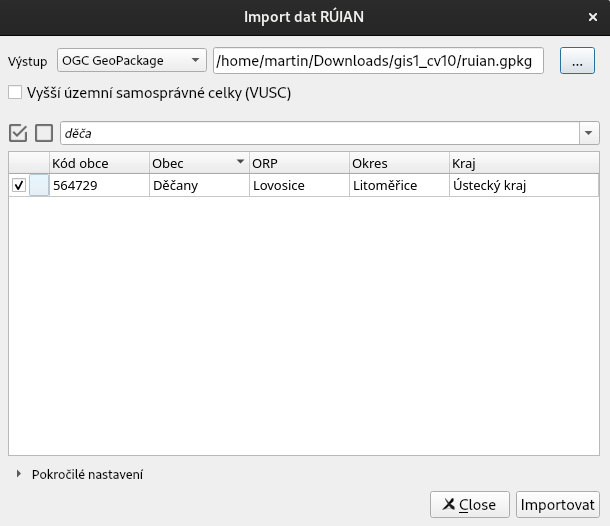

Výchozí symbologie vrstev je nastavena zásuvným modulem:

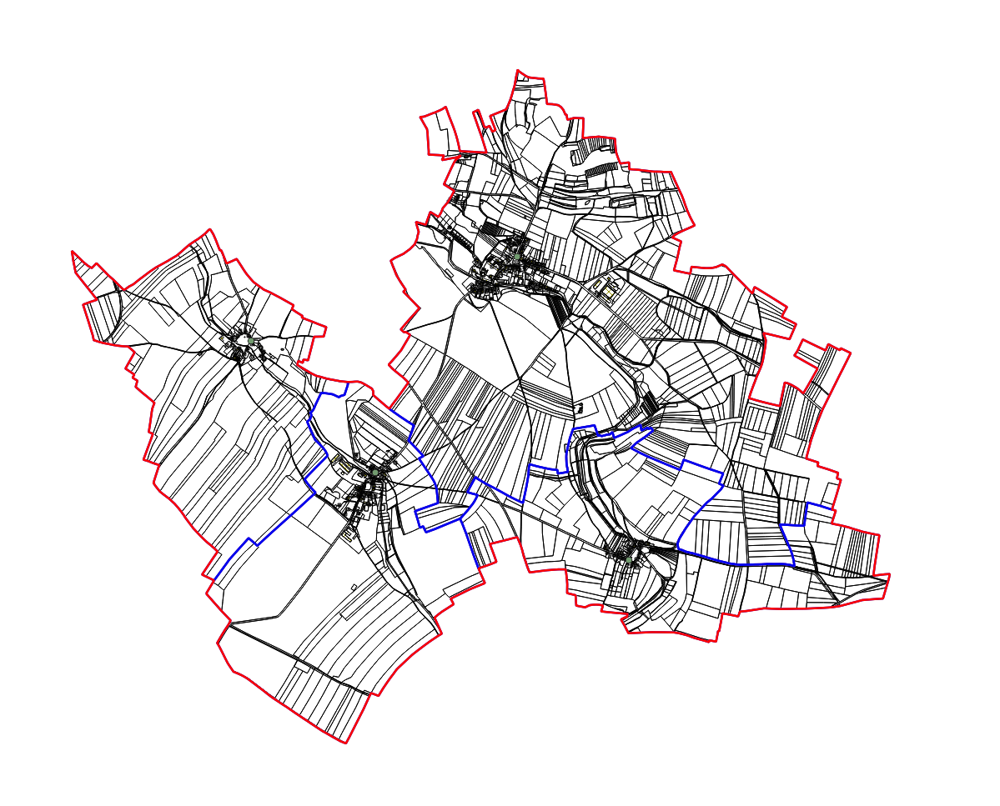

!!! note "Poznámka"

    Seznam vrstev je ovlivněn dostupností datových vrstev. U menších obcí může například chybět vrstva ulic a další.
    
    
    
Provedeme v projektu následující změny:

- odstraníme vrstvu "Části obcí" a "Adresní body"
- vypneme vrstvu "Katastrální území"
- přípojíme k vrstvě "Parcely" číselník (viz [předchozí cvičeni](./cviceni9.md)):   
    - [SC_D_POZEMKU](https://www.cuzk.cz/Katastr-nemovitosti/Poskytovani-udaju-z-KN/Ciselniky-ISKN/Ciselniky-k-nemovitosti/Druh-pozemku.aspx)
!!! warning "Důležité"
    Data načítejte namísto prostého přetažení pomocí dialogu `Layer > Data Source Manager`. V tomto případě se korektně nastaví datové typy sloupců. Kódování znaků nastavíme na `windows-1250`.
    
    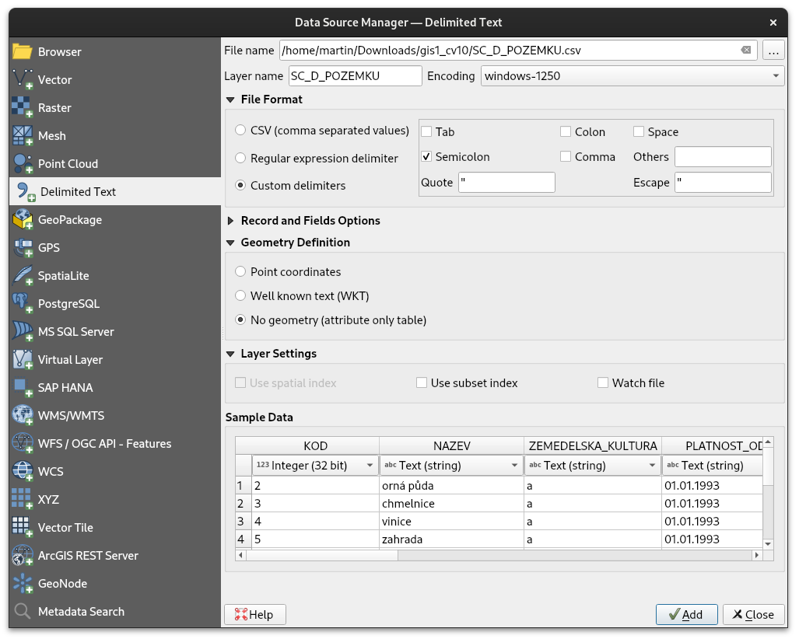
    
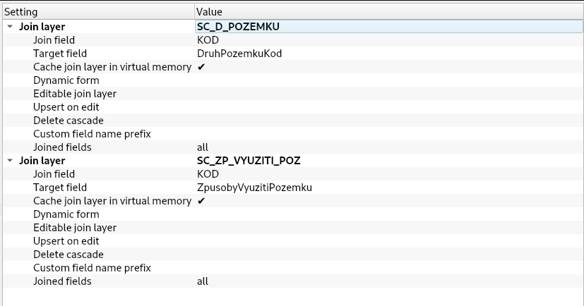


- podobně přípojíme číselník k vrstvě "Stavební objekty"
    - [SC_ZP_VYUZITI_BUD](https://www.cuzk.cz/Katastr-nemovitosti/Poskytovani-udaju-z-KN/Ciselniky-ISKN/Ciselniky-k-nemovitosti/Zpusob-vyuziti-stavby.aspx)
    
!!! task-fg-color "Úkol"

    Připojte další číselníky jako např. [SC_ZP_VYUZITI_POZ](https://www.cuzk.cz/Katastr-nemovitosti/Poskytovani-udaju-z-KN/Ciselniky-ISKN/Ciselniky-k-nemovitosti/Zpusob-vyuziti-pozemku.aspx) a další.
    
- na základě připojených číselníků nastavíme symbologii vrstev

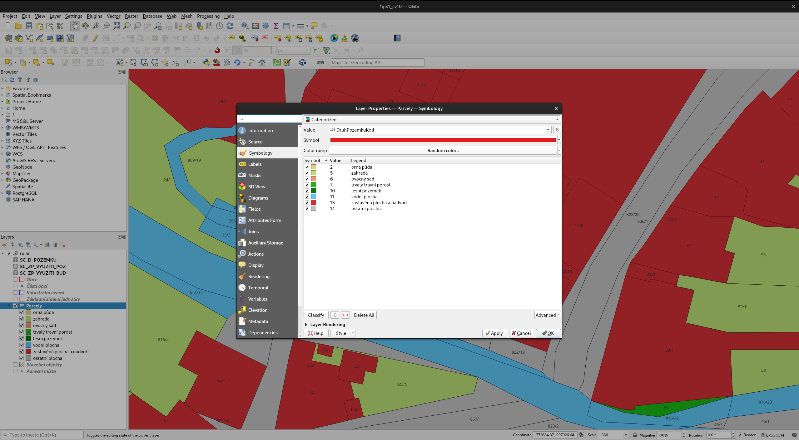

!!! tip

    U stavebních objektů můžeme nastavit číslo domovní pomocí funkce `regexp_substr`:
    
    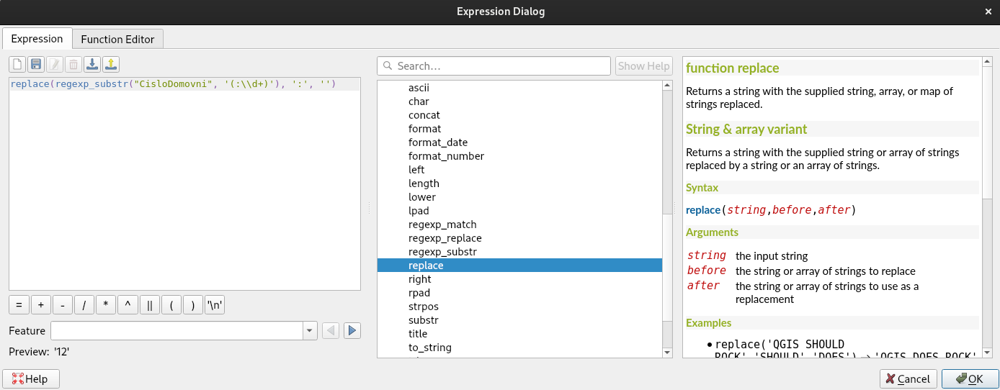
    
    Popisky nastavme tak, aby se zobrazovaly od měřítka 1:1000 (podobně jako u parcel).
    

    
- u vrstvy "Základní sídelní jednotky" nastavíme popisky podle atributu "Nazev" (pouze do měřítka 1:5000)
- nastavíme cílové pořadí vrstev

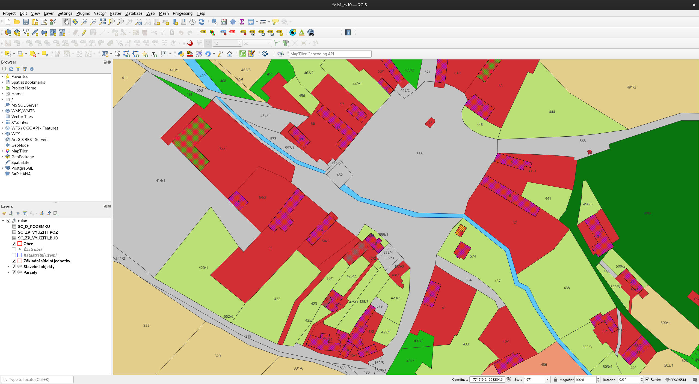

#### WMS zdroje

Do projektu přidáme vybrané [WMS
služby](https://geoportal.cuzk.cz/(S(ktfz4kwhtke20faayarg2abz))/Default.aspx?mode=TextMeta&side=wms.verejne&text=WMS.verejne.uvod&headtab=sekce-03-gp&menu=311)
poskytované ČÚZK. Pokud existuje ale ekvivalentní [WMTS](
https://geoportal.cuzk.cz/(S(ktfz4kwhtke20faayarg2abz))/Default.aspx?mode=TextMeta&side=wmts.uvod&text=wmts.uvod&head_tab=sekce-03-gp&menu=315)
služba, zvolíme raději tuto formu. WMTS by měla pozitivně ovlivnit
rychlost načítání vrstvy.

- ZTM5 - `https://ags.cuzk.cz/arcgis1/rest/services/ZTM/MapServer/WMTS`
- Ortofoto - `https://ags.cuzk.cz/arcgis1/rest/services/ORTOFOTO/MapServer/WMTS`
   
Služby přidáme pomocí `Layer > Data Source Manager`:

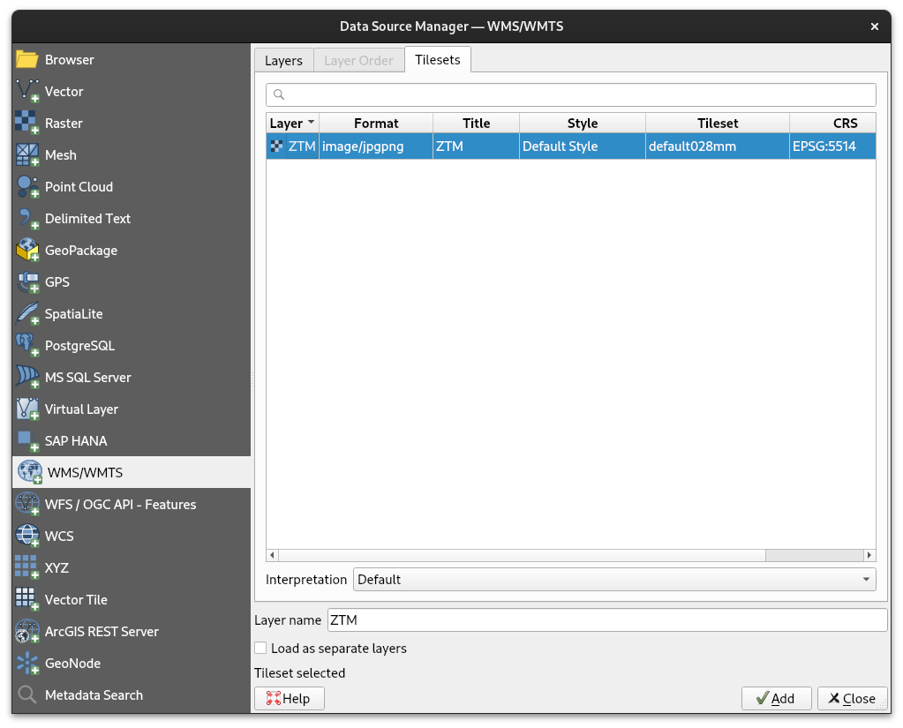

Přidané WMS služby nahrajeme do mapového okna. 

!!! tip

    WMS vrstvy je užitečné seskupit do nové skupiny:
    
    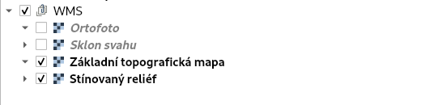

Dalším z datových zdrojů mohou být WMS služby poskytované agenturou
[CENIA](https://geoportal.gov.cz/arcgis/rest/services/CENIA). Pro náš
účel vyberme III. vojenské mapování: `https://geoportal.gov.cz/arcgis/services/CENIA/cenia_rt_III_vojenske_mapovani/MapServer/WMSServer`:


!!! task-fg-color "Úkol"

    Přidejte do projektu další zdroje dat jako např. Stínovaný model reliéfu - `https://ags.cuzk.cz/arcgis2/services/dmr5g/ImageServer/WMSServer`:
    
    - dmr5g:GrayscaleHillshadeZ10
    - dmr5g:SlopeRGBMap
   
    Dojem plastičnosti můžeme dosáhnout kombinací Základní topografické
    mapy při dané míře průhlednosti a vrstvy
    "dmr5g:SlopeRGBMap". Ukázka vizualizace při míře transparentnosti
    75%:
   
    

#### WFS zdroje

Do projektu přidáme vybrané [WFS
služby](https://geoportal.cuzk.cz/(S(ktfz4kwhtke20faayarg2abz))/Default.aspx?mode=TextMeta&side=wfs&text=wfs&head_tab=sekce-03-gp&menu=333)
poskytované ČÚZK. Vybereme následující vrstvy z datového zdroje
"Stahovací služba WFS - ZABAGED® - polohopis"
(`https://ags.cuzk.cz/arcgis/services/ZABAGED_POLOHOPIS/MapServer/WFSServer`):

- `zbg:Lesní_půda_se_stromy_kategorizovaná__plocha_`
- `zbg:Vodní_plocha`
- `zbg:Vodní_tok`


U jednotlivých vrstev nastavíme symbologii a vrstvy přejmenujeme:

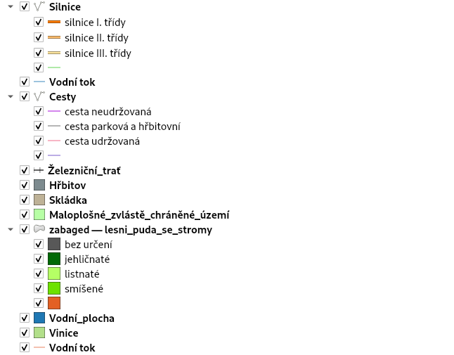

!!! warning "Důležité"

    Vrstvy, u kterých budeme nastavovat kategorizovaný styl doporučujeme stáhnout do lokální databáze ve formátu GeoPackage:

    

    Při stažení dat nastavte korektně zájmové území(!!!):
    
    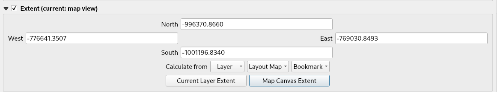

    Kategorizované styly jsou ke stažení [zde](https://geo.fsv.cvut.cz/vyuka/155gis1/gis1_cv10_styly.zip).
    
Na závěr nastavme výchozí kompozici. V našem případě jsou parcely
nastaveny na průhlednost 50%. Na pozadí stínovaná základní
topografická mapa:


!!! task-fg-color "Úkol"

    Přidejte do projektu další vhodné WFS vrstvy z datového zdroje ZABAGED, jako např.:
    
    - `zbg:Stožár_elektrického_vedení`
    - `zbg:Mohyla__pomník__náhrobek`
    - `zbg:Kříž__sloup_kulturního_významu`
    - `zbg:Úřad_veřejné_správy_-_definiční_bod`
    - `zbg:Škola_-_definiční_bod`
    - `zbg:Hasičská_stanice__zbrojnice_-_definiční_bod`
    - `zbg:Pošta_-_definiční_bod`
    - `zbg:Elektrické_vedení`
    - `zbg:Silnice__dálnice`
    - `zbg:Vodní_tok`
    - `zbg:Cesta`
    - `zbg:Železniční_trať`
    - `zbg:Hřbitov`
    - `zbg:Skládka`
    - `zbg:Maloplošné_zvlástě_chráněné_území`
    - `zbg:Vinice`

    Výsledek může pro zájmovou oblast vypadat následovně:

    

    **Tip pro pokročilejší uživatele:** QGIS umožňuje také automatizaci ve formě Python skriptů. Ukázka skriptu níže:
    
    - stáhne vybrané vrstvy z WFS
    - ořeže prvky hranicí obce
    - uloží na disk ve formátu OGC GeoPackage
    
    ```py
    # download WFS layer and store in output GPKG
    def download_wfs_layer(url, typename_name, layer_ref, output_path, layer_name):
        # define WFS connection
        uri = f"pagingEnabled='true' preferCoordinatesForWfsT11='false' restrictToRequestBBOX='1' " \
              f"srsname='EPSG:5514' typename='{typename_name}' url='{url}' version='auto'"
        layer = QgsVectorLayer(uri, "WFS_Layer", "WFS")
        if not layer.isValid():
            return None

        options = QgsVectorFileWriter.SaveVectorOptions()
        options.driverName = "GPKG"
        options.layerName = layer_name
        options.filterExtent = layer_ref.extent()

        # define temporary output
        dest = QgsProcessingParameterVectorDestination(name=layer_name)
        layer_tmp_path = dest.generateTemporaryDestination()

        # download WFS data
        res = QgsVectorFileWriter.writeAsVectorFormatV3(
            layer,
            layer_tmp_path,
            layer.transformContext(),
            options
        )

        # fix invalid geometries
        proc = processing.run("native:fixgeometries", {
            'INPUT': layer_tmp_path,
            'METHOD':1,
            'OUTPUT': 'TEMPORARY_OUTPUT',
        })

        # clip features by reference layer
        processing.run('native:clip', {
            'INPUT': proc['OUTPUT'],
            'OVERLAY': layer_ref,
            'OUTPUT': f'ogr:dbname="{output_path}" table="{layer_name}" (geom)'
        })

    url = "https://ags.cuzk.cz/arcgis/services/ZABAGED_POLOHOPIS/MapServer/WFSServer"
    layers = [
        'zbg:Stožár_elektrického_vedení', 
        'zbg:Mohyla__pomník__náhrobek', 
        'zbg:Kříž__sloup_kulturního_významu', 
        'zbg:Úřad_veřejné_správy_-_definiční_bod', 
        'zbg:Škola_-_definiční_bod', 
        'zbg:Hasičská_stanice__zbrojnice_-_definiční_bod',
        'zbg:Pošta_-_definiční_bod',
        'zbg:Elektrické_vedení',
        'zbg:Silnice__dálnice',
        'zbg:Vodní_tok',
        'zbg:Cesta',
        'zbg:Železniční_trať',
        'zbg:Hřbitov',
        'zbg:Skládka',
        'zbg:Maloplošné_zvlástě_chráněné_území',
        'zbg:Vinice',
        'zbg:Lesní_půda_se_stromy_kategorizovaná__plocha_',
        'zbg:Vodní_plocha',
    ]

    output_path  = os.path.join(QgsProject.instance().readPath("./"), "zabaged.gpkg")
    group_name = "ZABAGED"

    # get reference layer
    layer_extent = QgsProject.instance().mapLayersByName('Obce')[0]

    # find/add group into layer tree
    root = QgsProject.instance().layerTreeRoot()
    group = root.findGroup(group_name)
    if group is None:
        group = root.insertGroup(0, group_name)

    for type_name in layers:
        print(f"Processing {type_name}...")
        layer_name = type_name.lstrip('zbg:').replace('_', ' ')
        # remove non-ascii characters
        layer_output = re.sub(r'[^\x00-\x7F]', ' ', layer_name).replace(' ', '_').lower()

        download_wfs_layer(url, type_name, layer_extent, output_path, layer_output)
        # add new layer into layer tree
        layer_new = QgsVectorLayer(f"{output_path}|layername={layer_output}", layer_name, "ogr")
        QgsProject.instance().addMapLayer(layer_new, False)
        group.addLayer(layer_new)

    print("done")
    ```
    
    <video controls="true" allowfullscreen="true" width=99%>
    <source src="../../assets/cviceni10/qgis_wfs_download.webm" type="video/webm" markdown="1">
    </video>

#### Další zdroje dat

- [Národní katalog otevřených dat](https://data.gov.cz/datov%C3%A9-sady)
- [OpenStreetMap](https://wiki.openstreetmap.org/wiki/Cs:Map_Features)

!!! task-fg-color "Úkol"

    Přidejte do projektu vrstvu "Občanské vybavenosti" ([amenity](https://wiki.openstreetmap.org/wiki/Cs:Map_Features#Ob%C4%8Dansk%C3%A1_vybavenost_(Amenity))). 
    
    Doinstalujte do QGISu zásuvný modul QuickOSM a pomocí něj vytvořte vrstvu občanské vybavenosti (rozsah území nastavte na základě vrstvy "Obce"):
    
    
    
    Prvky ležící na území obce omezte pomocí nástroje *Clip* a uložte do nové vrstvy. Nastavte kategorizovanou symbologii podle atributu ``amenity`` a přeložte popisky v legendě do češtiny:
    
    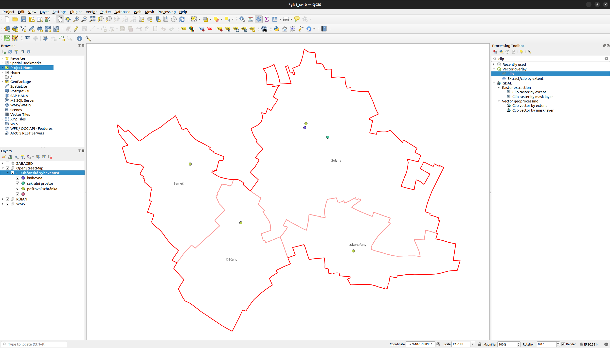
    
    Přidejte do projektu další vhodné vrstvy na základě [OpenStreetMap](https://wiki.openstreetmap.org/wiki/Cs:Map_Features).

!!! note "Poznámka"

    Ukázkový QGIS projekt ke stažení [zde](https://geo.fsv.cvut.cz/vyuka/155gis1/gis1_cv10_projekt.zip).

### Publikace projektu

Podklady: [dokumentace Gisquick](https://gisquick.readthedocs.io)

!!! warning "Důležité"

    Pro účel výuky budeme používat vlastní instanci publikačního serveru Gisquick provozované na **<http://geo102.fsv.cvut.cz:8083/>**.

Po [přihlášení](http://geo102.fsv.cvut.cz:8083/user/) se objeví profil uživatele:

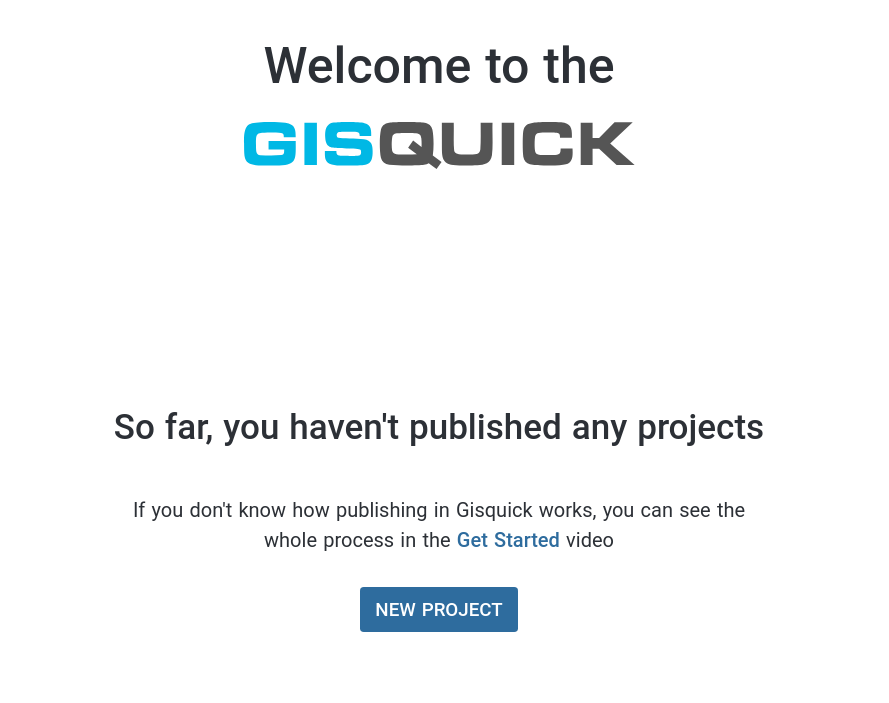

Vytvoříme nový projekt. Objeví se žádost o instalaci zásuvného modulu:

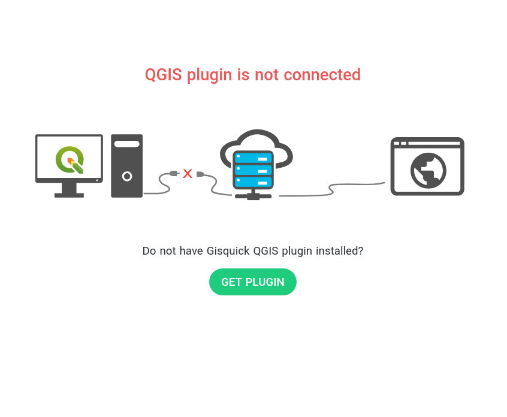

!!! note "Poznámka"

    Pokud se výše uvedená stránka neobjeví, tak ji najdete na <https://gisquick.org/plugin/>

Při instalaci postupuje podle [návodu](https://gisquick.readthedocs.io/en/latest/user-manual/before-publishing.html#qgis-gisquick-plugin) v dokumentaci Gisquick.

Jelikož pracujeme v projektu s formátem GeoPackage, tak nainstalujeme
verzi zásuvného modulu Gisquick s podporou dbhash. Tato verze
zásuvného modulu zamezí znovu nahrávání datových zdrojů ve formátu
GeoPackage například při změně viditelnosti vrstvy.

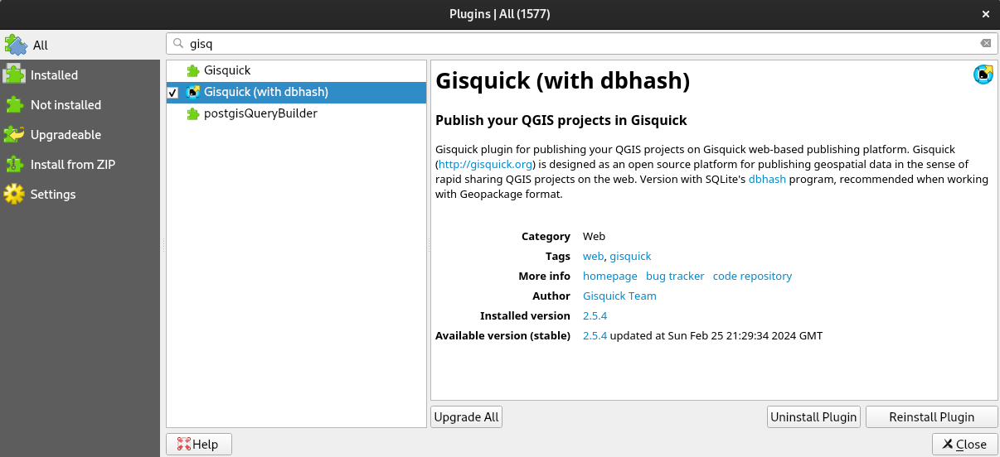

Poté se pomocí zásuvného modulu přihlásíme do prostředí publikační
platformy Gisquick (`Web > Publish in Gisquick`). 

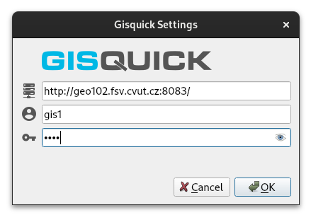

Do publikačního prostředí platformy Gisquick nás přesměruje tlačítko `Open Browser`:


Po vytvoření projektu se objeví úvodní formulář se seznamem vrstev určených k publikaci:

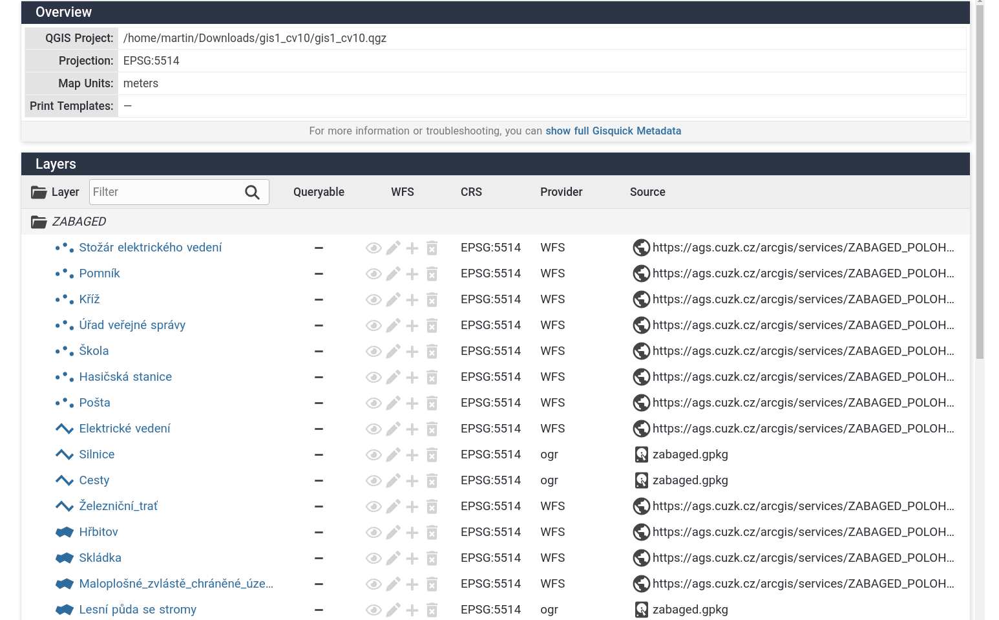

Nejprve opravíme případné chyby (`Manage Layers Names` > `Generate Names` > `Update QGIS Project`):


Dále povolíme WFS, abychom umožnili uživateli se dotazovat na vektorové vrstvy:

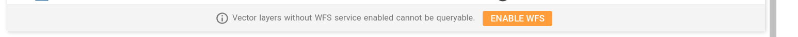

Datové vrstvy nahrajeme na publikační server:

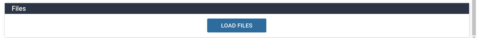


Nastavíme titulek projektu:

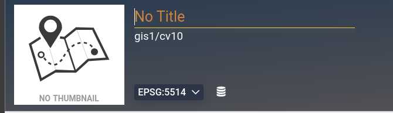

Projdeme jednotlivá nastavení projektu:

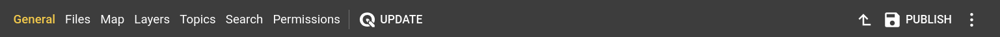

A provedeme následující změny v nastavení:

- prostorový rozsah nastavíme z vrstvy "Obce":

<video controls="true" allowfullscreen="true" width=99%>
<source src="../../assets/cviceni10/gisquick_extent.webm" type="video/webm" markdown="1">
</video>
    
- nastavíme vhodnou měřítkovou sadu:

    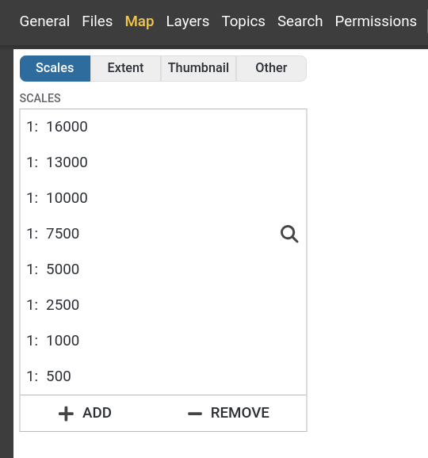

- v záložce `Layers` přesuňte vrstvy ze skupiny "WMS" do `Base Layers` (je nutné přesunout celou skupinu)

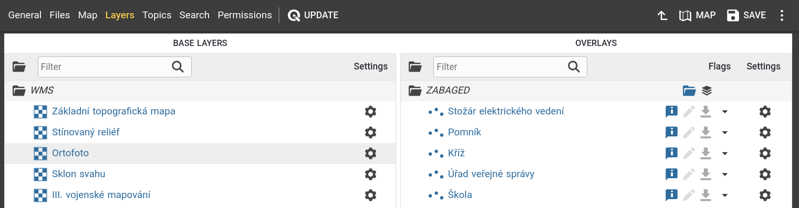

!!! tip "Tip pro pokročilé uživatele"

    Ke zrychlení načítání vrstev může dojít při vhodně zvolené měřítkové sadě dle [specifikace ČÚZK](https://geoportal.cuzk.cz/Dokumenty/Dlazdicove_sluzby_CR_v1.1.pdf). Případně lze použít WMTS s měřítkovou sadou Google Maps.
    

A připravený projekt publikujeme (`Publish`). Po publikaci projektu se objeví tlačítko

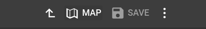

které nás přesměruje do mapové aplikace:


!!! tip

    Ve výchozím nastavení je projekt nastaven jako soukromý. Toto nastavení lze změnit v `Permissions`:
    
    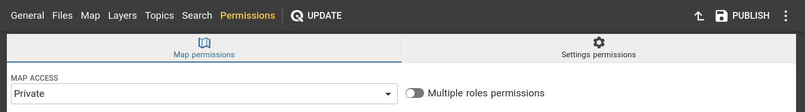

#### Další nastavení projektu

Zkusme změnit následující nastavení projektu:
    
- skryjeme CSV tabulky v záložce `Layers`

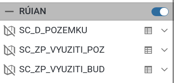

<video controls="true" allowfullscreen="true" width=99%>
<source src="../../assets/cviceni10/gisquick_visibility.webm" type="video/webm" markdown="1">
</video>

- nastavíme viditelnost zvolených atributů u vrstvy "Parcely" (kmenové
  číslo, pododdělení čísla, výměra a druh pozemku)
  
Nejprve v QGISu nastavíme u zvolených atributů aliasy (`Attributes Form` ve vlastnostech vrstvy).

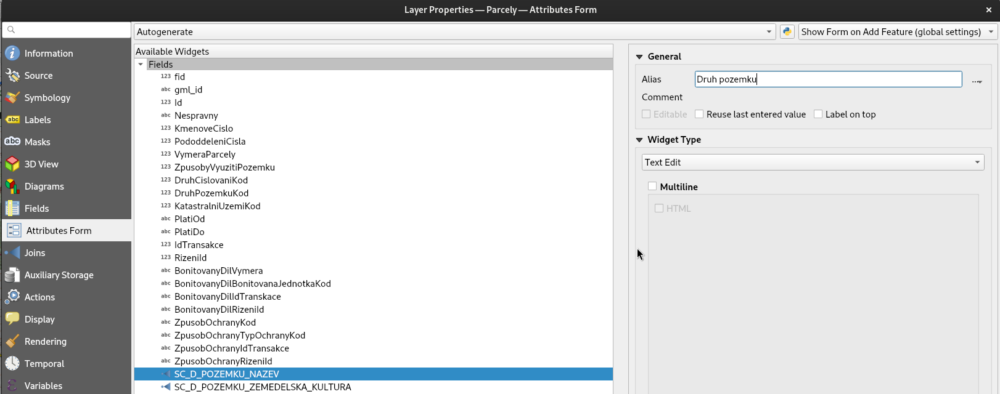

Změny v QGIS projektu uložíme. V nastavení Gisquick projektu provedeme aktualizaci.

<video controls="true" allowfullscreen="true" width=99%>
<source src="../../assets/cviceni10/gisquick_update.webm" type="video/webm" markdown="1">
</video>

Viditelnost atributů nastavíme z záložce `Layers`.

<video controls="true" allowfullscreen="true" width=99%>
<source src="../../assets/cviceni10/gisquick_field_visibility.webm" type="video/webm" markdown="1">
</video>

Po uložení změn (`Save`) znovu načteme mapovou aplikaci.

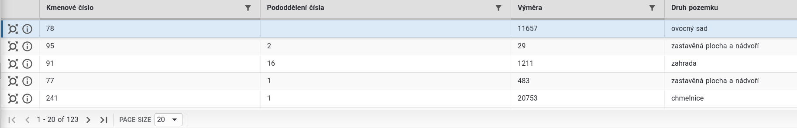

Po uložení změn se mezi podkladovými vrstvami jednoduše přepínat.


!!! task-fg-color "Úkol"

    Podkladovou vrstvu je možné mít zapnutou pouze jednu. Nelze tedy kombinovat základní topografickou mapu a stínovaný reliéf. Tyto vrstvy lze přesunou zpátky do "Overlays". To bude ale vyžadovat nejprve vrstvy v QGISu přesunout mimo skupinu "WMS" a poté změnit nastavení Gisquick záložce `Layers`. Výsledek může vypadat následovně:
    
    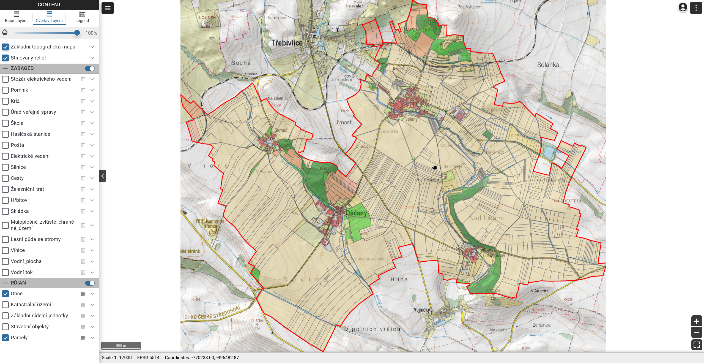

Ukázkovou mapovou aplikaci najdete na adrese <http://geo102.fsv.cvut.cz:8083/?PROJECT=gis1/cv10>
