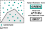

# Vektorová data, atributové dotazy, prostorové dotazy

## Cíl cvičení

- Vysvětlení rozdílu mezi vektorovými a rastrovými GIS daty
- Selekce prvků podle atributů
- Selekce prvků na základě vzájemných prostorových vztahů

## Vektorová a rastrová prostorová data

-   :material-vector-polyline:{ .lg .middle } __Vektorová data__

    ---

    Tvořena __vrcholy__ (Vertices) a __cestami__ (Paths) – ty jsou určeny skutečnými souřadnicemi

    Podrobnost je určena __podrobností souřadnic vrcholů__

    Vhodné pro __diskrétně rozložená data__ (např. poloha bodů, kategorie pokrytí půdy)

    Možné problémy s __topologií__ (mezery a překryvy)

-   :material-grid:{ .lg .middle } __Rastrová data__součástí budoucích cvičení

    ---

    Tvořena pravidelnou mřížkou __pixelů__ – ty jsou určeny pixelovými souřadnicemi (pořadí řádku/sloupce)

    Podrobnost je určena __velikostí pixelu__ (v metrech)

    Vhodné pro jevy měnící se __spojitě__ (např. model terénu, znečištění ovzduší) i __diskrétně__, dále pak __obrazová data__ (např. satelitní)

## Atributové dotazy

Atributový dotaz (Attribute Query) je metoda výběru/filtrace prvků na základě **hodnot jejich atributů**. Doplňuje tak metodu [interaktivního výběru prvků](/cviceni/cviceni1/#select-tool) z 1. cvičení. Základem je pravidlo pro výběr – tzv. **výraz** (Expression). ArcGIS Pro umožňuje sestavovat výrazy interaktivně pomocí dialogu, nicméně pro využití plného potenciálu výrazů je vhodné využít kód v jazyce _SQL_.
  

**Atributový dotaz** (nad daty v mapě): _:material-tab: Map_{: .outlined_code} → _:material-button-cursor: Select By Attributes_{: .outlined_code} → vyplnit údaje do dialogu nástroje...
[Select features using attributes](https://pro.arcgis.com/en/pro-app/latest/help/mapping/navigation/select-features-using-attributes.htm){ .md-button .md-button--primary .button_smaller .external_link_icon target="_blank"}

{: .off-glb .process_icon}

{: .off-glb .process_icon}

{: .process_container}

<figcaption markdown>Do pole `Input Rows` je automaticky předvyplněna vrstva vybraná v obsahu mapy </figcaption>

Pomocí přepínátka {: .off-glb style="vertical-align: -20%;margin:0px 5px;"} lze měnit zápis mezi interaktivním dialogovým zadáním a výrazem v jazyce SQL.

[Introduction to query expressions](https://pro.arcgis.com/en/pro-app/latest/help/mapping/navigation/write-a-query-in-the-query-builder.htm){ .md-button .md-button--primary .button_smaller .external_link_icon target="\_blank"}
[Construct and modify queries](https://pro.arcgis.com/en/pro-app/latest/help/mapping/navigation/construct-and-modify-queries.htm){ .md-button .md-button--primary .button_smaller .external_link_icon target="\_blank"}
{: .button_array}

 <!-- trik: vlastnosti tabulky pro vsechny podrizene -->
???+ task-fg-color "Příklad k vyzkoušení __|__{style="margin: 0rem 1rem"} __testování atributových dotazů na skutečných datech__{.no-dec}"

    <iframe width="100%" height="500" frameborder="0" allowfullscreen src="https://geo.fsv.cvut.cz/data/hoffmann/appquery/"></iframe>

    |atribut|datový typ|popis|
    |-|-|-|
    |stop_name|`string`|Název zastávky|
    |routes_nam|`string`|Označení linek, které obsluhují zastávku, ve formátu `-cislolinky-,-cislolinky-` řazeno vzestupně|
    |route_type|`integer`|ID druhu dopravy, které obsluhují zastávku,  `0=tramvaj`, `1=metro`, `2=vlak`, `3=autobus`, `4=přívoz`, `7=lanovka`, `8=tramvaj i autobus`|
    |on_request|`integer`|Zastávka na znamení `0=není na znamení`, `1=je na znamení`|
    |platf_len|`float`|Délka nástupiště (metry)|

## Prostorové dotazy

__Prostorový dotaz__ (Spatial Query) je metoda výběru/filtrace prvků jedné vrstvy __na základě vzájemné polohy s prvky druhé vrstvy__. Funkce využívá jako vstup `vrstvu vybíraných prvků`, `vrstvu pro překryvnou analýzu` a `vztah pro překryvnou analýzu`.

{ .no-filter }
{ .no-filter }
{: .process_container}

 <!-- trik: vlastnosti tabulky pro vsechny podrizene -->

=== "Výběr BODŮ..."

    === "...v překrytu s BODY"

        { style="filter:none !important;" }
        {: align=center}

        <table style="width:unset;">
            <tr><td>Intersect</td><td>A</td></tr>
            <tr><td>Intersect (DBMS)</td><td>A</td></tr>
            <tr><td>Contains</td><td>A</td></tr>
            <tr><td>Contains Clementini</td><td>A</td></tr>
            <tr><td>Within</td><td>A</td></tr>
            <tr><td>Within Clementini</td><td>A</td></tr>
            <tr><td>Are identical to</td><td>A</td></tr>
            <tr><td>Have their center in</td><td>A</td></tr>
        </table>

    === "...v překrytu s LINIEMI"

        { style="filter:none !important;" }
        {: align=center}

        <table id="small_table_padding" style="width:unset;">
            <tr><td>Intersect</td><td>A, C</td></tr>
            <tr><td>Intersect (DBMS)</td><td>A, C</td></tr>
            <tr><td>Within</td><td>A, C</td></tr>
            <tr><td>Completely within</td><td>A</td></tr>
            <tr><td>Within Clementini</td><td>A</td></tr>
            <tr><td>Have their center in</td><td>A, C</td></tr>
            <tr><td>Boundary touches</td><td>C</td></tr>
        </table>

    === "...v překrytu s POLYGONY"

        { style="filter:none !important;" }
        {: align=center}

        <table id="small_table_padding" style="width:unset;">
          <tr><td>Intersect</td><td>A, C</td></tr>
          <tr><td>Intersect (DBMS)</td><td>A, C</td></tr>
          <tr><td>Within</td><td>A, C</td></tr>
          <tr><td>Completely within</td><td>A</td></tr>
          <tr><td>Within Clementini</td><td>A</td></tr>
          <tr><td>Have their center in</td><td>A, C</td></tr>
          <tr><td>Boundary touches</td><td>C</td></tr>
        </table>

=== "Výběr LINIÍ..."

    === "...v překrytu s BODY"

        { style="filter:none !important;" }
        {: align=center}

        <table id="small_table_padding" style="width:unset;">
          <tr><td>Intersect</td><td>A, C, D</td></tr>
          <tr><td>Intersect (DBMS)</td><td>A, C, D</td></tr>
          <tr><td>Contains</td><td>A, C, D</td></tr>
          <tr><td>Completely contains</td><td>A, D</td></tr>
          <tr><td>Contains Clementini</td><td>A, D</td></tr>
          <tr><td>Have their center in</td><td>D</td></tr>
          <tr><td>Boundary touches</td><td>C</td></tr>
        </table>

    === "...v překrytu s LINIEMI"

        { style="filter:none !important;" }
        {: align=center}

        <table id="small_table_padding" style="width:unset;">
          <tr><td>Intersect</td><td>A, C, D, E, F, G, H, I, J</td></tr>
          <tr><td>Intersect (DBMS)</td><td>A, C, D, E, F, G, H, I, J</td></tr>
          <tr><td>Contains</td><td>G, H</td></tr>
          <tr><td>Completely contains</td><td>G</td></tr>
          <tr><td>Contains Clementini</td><td>G, H</td></tr>
          <tr><td>Within</td><td>F, H</td></tr>
          <tr><td>Completely within</td><td>F</td></tr>
          <tr><td>Within Clementini</td><td>F, H</td></tr>
          <tr><td>Are identical to</td><td>H</td></tr>
          <tr><td>Boundary touches</td><td>C, E</td></tr>
          <tr><td>Share a line segment with</td><td>F, G, H, I, J</td></tr>
        </table>

    === "...v překrytu s POLYGONY"

        { style="filter:none !important;" }
        {: align=center}

        <table id="small_table_padding" style="width:unset;">
          <tr><td>Intersect</td><td>A, C, D, E, F, G, H, I, J, K, L, M, N, O</td></tr>
          <tr><td>Intersect (DBMS)</td><td>A, C, D, E, F, G, H, I, J, K, L, M, N, O</td></tr>
          <tr><td>Within</td><td>A, D, G, H, I, O</td></tr>
          <tr><td>Completely within</td><td>A</td></tr>
          <tr><td>Within Clementini</td><td>A, D, G, H, I</td></tr>
          <tr><td>Boundary touches</td><td>F, G, H, I, K, L, M, N, O</td></tr>
          <tr><td>Share a line segment with</td><td>G, I, J, K, M, O</td></tr>
          <tr><td>Crossed by the outline of</td><td>C, E, H, L, N</td></tr>
          <tr><td>Have their center in</td><td>A, C, D, E, G, H, I, J, O</td></tr>
        </table>

=== "Výběr POLYGONŮ..."

    === "...v překrytu s BODY"

        { style="filter:none !important;" }
        {: align=center}

        <table id="small_table_padding" style="width:unset;">
          <tr><td>Intersect</td><td>A, B</td></tr>
          <tr><td>Intersect (DBMS)</td><td>A, B</td></tr>
          <tr><td>Contains</td><td>A, B</td></tr>
          <tr><td>Completely contains</td><td>A</td></tr>
          <tr><td>Contains Clementini</td><td>A</td></tr>
          <tr><td>Have their center in</td><td>A, D</td></tr>
          <tr><td>Boundary touches</td><td>B</td></tr>
        </table>

    === "...v překrytu s LINIEMI"

        { style="filter:none !important;" }
        {: align=center}

        <table id="small_table_padding" style="width:unset;">
          <tr><td>Intersect</td><td>A, C, D, E, F, G, H, I, J, K, L, M, N, O</td></tr>
          <tr><td>Intersect (DBMS)</td><td>A, C, D, E, F, G, H, I, J, K, L, M, N, O</td></tr>
          <tr><td>Contains</td><td>A, D, G, H, I, O</td></tr>
          <tr><td>Completely contains</td><td>A</td></tr>
          <tr><td>Contains Clementini</td><td>A, D, G, H, I</td></tr>
          <tr><td>Boundary touches</td><td>F, G, H, I, K, L, M, N, O</td></tr>
          <tr><td>Share a line segment with</td><td>G, I, J, K, M, O</td></tr>
          <tr><td>Crossed by the outline of</td><td>C, E, H, L, N</td></tr>
          <tr><td>Have their center in</td><td>E, I, L</td></tr>
        </table>

    === "...v překrytu s POLYGONY"

        { style="filter:none !important;" }
        {: align=center}

        <table id="small_table_padding" style="width:unset;">
          <tr><td>Intersect</td><td>A, C, D, E, F, G, H, I, J, K, M</td></tr>
          <tr><td>Intersect (DBMS)</td><td>A, C, D, E, F, G, H, I, J, K, M</td></tr>
          <tr><td>Contains</td><td>C, E, H, M</td></tr>
          <tr><td>Completely contains</td><td>C</td></tr>
          <tr><td>Contains Clementini</td><td>C, E, H, M</td></tr>
          <tr><td>Within</td><td>F, G, H, M</td></tr>
          <tr><td>Completely within</td><td>F</td></tr>
          <tr><td>Within Clementini</td><td>F, G, H, M</td></tr>
          <tr><td>Are identical to</td><td>H, M</td></tr>
          <tr><td>Boundary touches</td><td>D, E, G, H, I, J, M</td></tr>
          <tr><td>Share a line segment with</td><td>D, H, I, M</td></tr>
          <tr><td>Crossed by the outline of</td><td>A, E, G, J, K</td></tr>
          <tr><td>Have their center in</td><td>C, E, F, G, H, K, L</td></tr>
        </table>
        

<figcaption markdown>zdroj: [Select By Location graphic examples](https://pro.arcgis.com/en/pro-app/latest/tool-reference/data-management/select-by-location-graphical-examples.htm)</figcaption>

[:material-open-in-new: Select features by location](https://pro.arcgis.com/en/pro-app/latest/help/mapping/navigation/select-features-by-location.htm){ .md-button .md-button--primary .button_smaller target="\_blank"}
[:material-open-in-new: Select Layer By Location (Data Management)](https://pro.arcgis.com/en/pro-app/latest/tool-reference/data-management/select-layer-by-location.htm){ .md-button .md-button--primary .button_smaller target="\_blank"}
[:material-open-in-new: Select By Location graphic examples](https://pro.arcgis.com/en/pro-app/latest/tool-reference/data-management/select-by-location-graphical-examples.htm){ .md-button .md-button--primary .button_smaller target="\_blank"}
{: align=center style="display:flex; justify-content:center; align-items:center; column-gap:20px; row-gap:10px; flex-wrap:wrap;"}

## Úlohy k procvičení

!!! task-fg-color "Úlohy k atributovým dotazům"

    K řešení následujích úloh použijte datovou sadu [ArcČR
    500](../../data/#arccr-500) verzi 3.3 dostupnou na disku *S* ve složče
    ``K155\Public\data\GIS\ArcCR500 3.3``. Zde také najdete souboru s
    popisem dat ve formátu PDF.

    1. Kolik je v ČR rybníků?

    2. Jaká je celková délka (v km) přirozených vodních toků v ČR?

    3. Jaká je průměrná nadmořská výška (v m) vodních nádrží v ČR?

    4. Kolik silnic v ČR má více než dva jizdní pruhy?

    5. Jaká je délka (v km) dálnic v ČR, které mají šest jízdních pruhů?

    6. Kolik železničních stanic v ČR obsahuje ve svém názvu předložku 'nad'?

    7. Jaká je celková plocha (v km^2^) sídel v ČR u kterých jejich název začíná na písmeno 'K'?

    8. Ve které obci Ústeckého kraje je největší nezaměstnanost a kolik to je?

    9. Najděte obec v ČR, kde je nejvyšší poměr mezi muži a ženami a kolik to je?

    10. V kolika obcích v ČR převyšuje počet sňatků počet rozvodů. V jaké
        obci je počet sňatků nejvyšší vzhledem k aktuálnímu počtu
        obyvatel?
    
    11. Jaká je průměrná hodnota nezaměstnanosti v ORP Beroun?

    12. Kolik katastrálních území spadá do oblasti s kódem LAU1 'CZ0327' a
        jakou mají celkovou výměru (v km^2^)?

    13. V kolika případech se shoduje název obce s názvem katastrálního území?

    14. Kolik katastrálních území začíná na písmeno 'R' a má přesně tři znaky ve svém názvu?

    15. Ve kterých krajích je míra nezaměstranosti mužů větší než u žen?

    16. Jaká je celková délka silnic 1., 2. a 3. třídy?

    17. Jaký název pro obec je nejfrekventovanější, kolik obcí s tímto názvem v ČR je?

    18. Pro každý typ vodní plochy najděte nejvyšší nadmořskou výšku.

    19. Jaký je poměr mezinárodních ku vnitrostátním letištím v ČR?

    20. Který okres v ČR se skládá z největšího počtu obcí a kolik to je?

!!! task-fg-color "Úlohy k prostorovým dotazům"

    K řešení následujích úloh použijte datovou sadu [ArcČR
    500](../../data/#arccr-500) verzi 3.3 dostupnou na disku *S* ve složče
    ``K155\Public\data\GIS\ArcCR500 3.3``. Zde také najdete souboru s
    popisem dat ve formátu PDF.

    1. Existuje v ČR letiště, jehož reprezentační bod leží v lese? Jak se jmenuje?

    2. Kolika obcemi v ČR neprochází žádná silnice?

    3. Kolik obcí leží na hranici ČR?

    4. Vyberte silnice, které kříží vodní toky. Kolik procent z těchto
       silnic tvoří silnice první třídy?

    5. Kolik procent rybníků z celkového počtu leží celou svojí plochou na
       území Jihočeského kraje?

    6. Na kolika mapových listech Základní mapy 1:25 000 leží alespoň
       částečně okres Litoměřice. Kolik mapových listů potom leží v tomto
       okresu celou svojí plochou?

    7. Kolik železničních stanic leží v lese a zároveň jejich název
       nezačíná na písmeno 'L'?

    8. Které silnice (uveďte jejich číslo) druhé třídy procházejí oblastí
       bažin a rašelinišť?

    9. Jaká je průměrná nadmořská výška výškových kót na území
       Středočeského kraje?

    10. Kolik vodních ploch leží alespoň částí své plochy ve vzdálenosti
        do 10 km od poledníku se zeměpisnou délkou 15°?

    11. Kolik obcí se dotýká alespoň jedním liniovým segmentem hranice kraje?

    12. Vyberte katastrální území, ve kterých leží alespoň částečně jedna
        vodní plocha, seskupte tyto území podle kódu NUTS (LAU1). Uveďte
        jaký kód NUTS má největší výměru a z kolika katastrálních území se
        skládá?

    13. Uveďte souřadnice reprezentačního bodu (centroidu) největší vodní
        nádrže v Libereckém kraji. O jakou vodní nádrž se jedná?

    14. Kolik obcí leží celou svojí plochou na mapovém listu "Pardubice"
        ZM 1<nowiki>:</nowiki>25 000. Do kolika ORP tyto obce patří a
        které to jsou?

    15. Kolik obcí v ČR leží svoji plochou alespoň na dvou mapových
        listech Základní mapy 1:50 000?

     

<!-- __:material-account-edit:{.lg .middle}VC__{style="font-size:70%;color:var(--md-code-fg-color);background-color:var(--md-code-bg-color);padding:.3em .5em;border-radius:.5rem;"}
{align=center} -->
