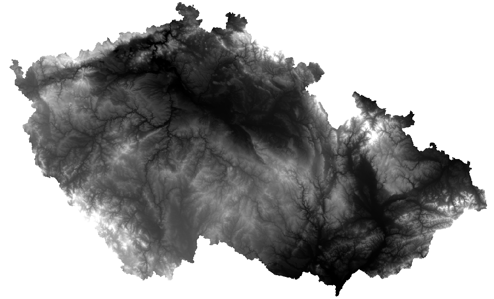
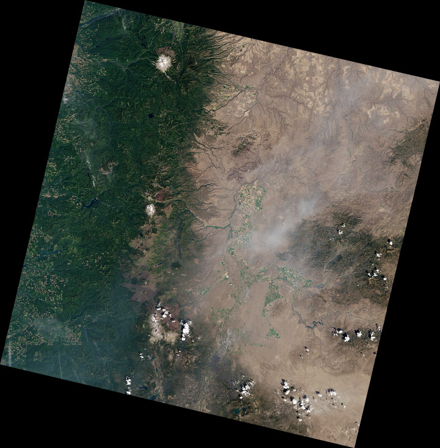
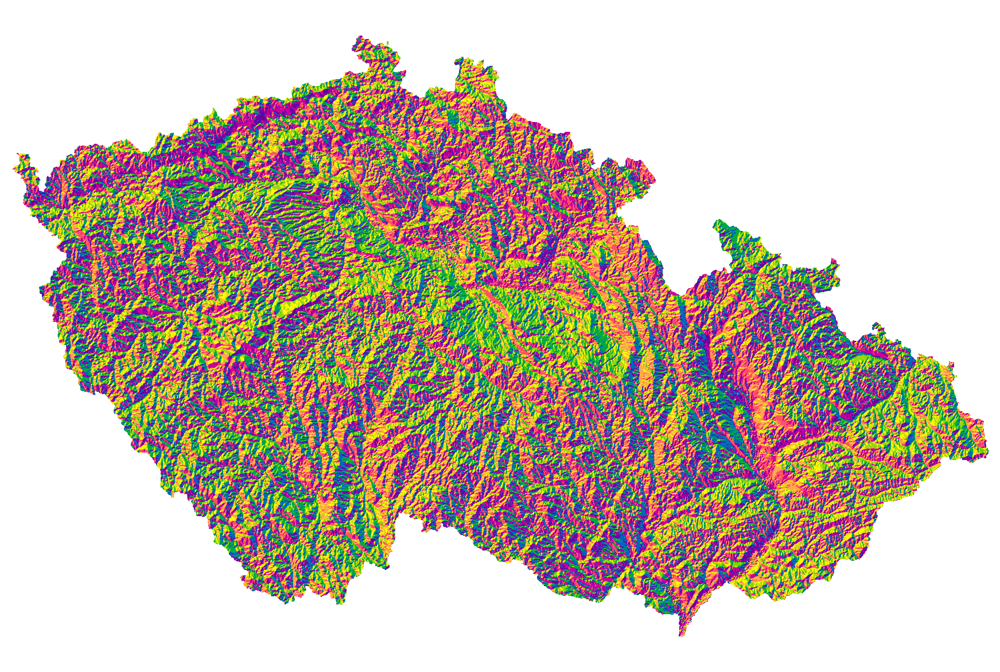

# Rastrová data, georeferencování

## Cíl cvičení

Seznámení se s rastrovými daty v GIS a ukázka využití těchto dat. Souřadnicové připojení rastrových dat. Práce s Mosaic Dataset. 

## Základní pojmy

- **rastr** – datová struktura založená na buňkách uspořádaných do řádek a sloupců, kde hodnota každé buňky reprezentuje hodnotu jevu
- [**rastrová data**](https://pro.arcgis.com/en/pro-app/latest/help/data/imagery/introduction-to-raster-data.htm) – prostorová data vyjádřená formou matice buněk nebo pixelů; spojitá data (nejčastěji digitální modely terénu, digitalizované mapy)
- [**pixel (buňka)**](https://pro.arcgis.com/en/pro-app/latest/help/data/imagery/pixel-size-of-image-and-raster-data-pro-.htm) – základní geometrický prvek zpravidla čtvercového tvaru; jeho množina vytváří rastrový digitální obraz; 1 buňka = 1 hodnota
- [**prostorové rozlišení rastru**](https://pro.arcgis.com/en/pro-app/latest/tool-reference/environment-settings/cell-size.htm) – velikost 1 buňky (pixelu) rastru (cell size)
- [**resample**](https://pro.arcgis.com/en/pro-app/latest/tool-reference/data-management/resample.htm) – změna prostorového rozlišení rastru
- **digitální model terénu (DMT)** – digitální reprezentace prostorových objektů (obecný pojem obsahující různé způsoby vyjádření terénního reiéfu nebo povrchu)
- **digitální model reliéfu (DMR)** – digitální reprezentace zemského povrchu (NEobsahuje vegetaci a lidské stavby)
- **digitální model povrchu (DMP)** – digitální reprezentace zemského povrchu (obsahuje vegetaci a lidské stavby, které jsou pevně spojené s reliéfem)
- [**transformace**](https://pro.arcgis.com/en/pro-app/latest/help/mapping/properties/geographic-coordinate-system-transformation.htm) – obecný pojem pro výpočet, jehož cílem je převod souřadnic bodů z jednoho souřadnicového systému do druhého
- [**georeference**](https://pro.arcgis.com/en/pro-app/3.0/help/data/imagery/overview-of-georeferencing.htm) – souřadnicové určení snímku
- [**pyramidování rastru**](https://pro.arcgis.com/en/pro-app/latest/help/data/imagery/raster-pyramids.htm) – ukládání dat do menšího rozlišení pro rychlejší práci; pyramidy (náhledy) jsou uloženy v souborech *.ovr*
- [**mosaic dataset**](https://pro.arcgis.com/en/pro-app/latest/help/data/imagery/mosaic-datasets.htm) – mozaika; datová sada sjednocující jeden či více rastrů; umožňuje ořez mimorámových údajů

???+ note "&nbsp;Digitální modely terénu České republiky"
     - **DMP 1G** – Digitální model povrchu České republiky 1. generace (DMP 1G) představuje zobrazení území včetně staveb a rostlinného pokryvu ve formě nepravidelné sítě výškových bodů (TIN) s úplnou střední chybou výšky **0,4 m** pro přesně vymezené objekty (budovy) a **0,7 m** pro objekty přesně neohraničené (lesy a další prvky rostlinného pokryvu). Model vznikl z dat pořízených metodou leteckého laserového skenování výškopisu území České republiky v letech 2009 až 2013. 
     - **DMR 4G** – Digitální model reliéfu České republiky 4. generace (DMR 4G) představuje zobrazení přirozeného nebo lidskou činností upraveného zemského povrchu v digitálním tvaru ve formě výšek diskrétních bodů v pravidelné síti (5 x 5 m) bodů o souřadnicích X,Y,H, kde H reprezentuje nadmořskou výšku ve výškovém referenčním systému Balt po vyrovnání (Bpv) s úplnou střední chybou výšky **0,3 m** v odkrytém terénu a **1 m** v zalesněném terénu. Model vznikl z dat pořízených metodou leteckého laserového skenování výškopisu území České republiky v letech 2009 až 2013.
     - **DMR 5G** – Digitální model reliéfu České republiky 5. generace (DMR 5G) představuje zobrazení přirozeného nebo lidskou činností upraveného zemského povrchu v digitálním tvaru ve formě výšek diskrétních bodů v nepravidelné trojúhelníkové síti (TIN) bodů o souřadnicích X,Y,H, kde H reprezentuje nadmořskou výšku ve výškovém referenčním systému Balt po vyrovnání (Bpv) s úplnou střední chybou výšky **0,18 m** v odkrytém terénu a **0,3 m** v zalesněném terénu. Model vznikl z dat pořízených metodou leteckého laserového skenování výškopisu území České republiky v letech 2009 až 2013. Dokončen byl k 30. 6. 2016 na celém území ČR. (Zdroj: ČÚZK)

## Použité datové podklady

- [ArcČR 500](../../data/#arccr-500)
- [Císařské otisky stabilního katastru](../../data/#cisarske-otisky-stabilniho-katastru)
- [DMR 4G](../../data/#dmr-5g)

## Náplň cvičení

### Ukázka nejčastějších rastrových typů dat

-   :material-elevation-rise:{ .lg .middle height} __Digitální model terénu/reliéfu__

    ---

    

-   :material-grid:{ .lg .middle } __Stínovaný reliéf__

    ---

    

-   :material-map:{ .lg .middle } __Naskenovaný mapový list__

    ---
    

-   :material-airplane:{ .lg .middle } __Ortofoto__

    ---
    

-   :fontawesome-solid-satellite:{ .lg .middle } __Družicová data__

    ---
    

### Práce s digitálním modelem reliéfu

**Zdroj dat** – DMR 4G ([ArcČR 500](../../data/#arccr-500))  
DMR 4G představuje hodnoty nadmořské výšky pro Českou republiku s rozlišením 5x5 metrů. Verze z ArcČR je však převzorkovaná a má velikost 1 pixelu 50x50 metrů.

**1.** Načteme DMR 4G z databáze ArcČR (vrstva _:simple-databricks: DigitalniModelReliefu_{: .outlined_code}).

**2.** Zjištění prostorového rozlišení rastru (pravý klik na daný rastr v záložce _:material-tab: Contents_{: .outlined_code} → _:material-form-dropdown: Properties_{: .outlined_code} → _:material-button-cursor: Source_{: .outlined_code} → _:material-button-cursor: Raster Information_{: .outlined_code} → _:material-button-cursor: Cell Size X/Y_{: .outlined_code}).

**3.** Vybereme okres pro ořez rastru (vrstva _:simple-databricks: OkresyPolygony_{: .outlined_code}).

**4.** Export vybraného okresu do samostatné vrstvy provedeme přes pravý klik myši na vybranou vrstvu → _:material-form-dropdown: Data_{: .outlined_code} → _:material-form-dropdown: Export Features_{: .outlined_code}.

<figure markdown>
  { width="800" }
  <figcaption>Export features</figcaption>
</figure>

**5.** Ořez rastru lze provést několika způsoby. Nejjednodušší možností je funkce [_:material-cog: **Clip Raster**_{: .outlined_code}](https://pro.arcgis.com/en/pro-app/latest/tool-reference/data-management/clip.htm), která vytvoří ořez dle nejmenšího ohraničujícího obdélníku.

<figure markdown>

    <figcaption>Clip raster</figcaption>
</figure>

**6.** Další možností je funkce [_:material-cog: **Extract by Mask**_{: .outlined_code}](https://pro.arcgis.com/en/pro-app/latest/tool-reference/spatial-analyst/extract-by-mask.htm), jež ořízne rastr přesně dle polygonu (s přesností na pixely).

<figure markdown>

    <figcaption>Extract by mask</figcaption>
</figure>

### Ukázka změny symbologie rastru

Rastrovým vrstvám lze (stejně jako vektorovým) měnit vzhled v záložce [_:material-tab: Symbology_{: .outlined_code} ](https://pro.arcgis.com/en/pro-app/latest/help/data/imagery/symbology-pane.htm). Nabídka se zobrazí pravým klinutím myši na danou vrstvu → _:material-form-dropdown: Symbology_{: .outlined_code}.

<figure markdown>
  
  <figcaption>Nastavení symbologie DMR</figcaption>
</figure>

### Processing templates

Processing templates jsou šablony, které se používají pro získání různých informací z dané vrstvy. Podkladem je stále jedna datová sada (např. [DMR5G](https://ags.cuzk.gov.cz/arcgis2/rest/services/dmr5g/ImageServer)), na kterou je však dle zvolení aplikována šablona, pomocí které se data rastru různě zpracují. Ve výsledku tímto způsobem dokážeme z jednoho rastru získat informace například o reálných výškách terénu, stínovaném reliéfu či vypočtené sklonitosti svahů. Ne všechny služby tyto šablony nabízejí k dispozici.

Dostupné šablony pro konkrétní rastrovou službu najdeme v záložce _:material-tab: Data_{: .outlined_code} po vybrání požadvané vrstvy. Možnosti se zobrazí po rozkliknutí tlačítka _:material-button-cursor: Processing Templates_{: .outlined_code}

<figure markdown>
  {width="800"}
  <figcaption>Zobrazení dostupných processing templates</figcaption>
</figure>

Více o rastrových funkcích bude součástí předmětu [GIS 2](https://k155cvut.github.io/gis-2/). 

-   __Reálné výšky terénu (None)__

    ---

    

-   __Stínovaný reliéf (GrayscaleHillshade)__

    ---

    

-   __Sklonitost terénu (SlopeRGBMap)__

    ---
    

-   __Orientace terénu na světovou stranu (AspectRGBMap)__

    ---
    

### Georeferencování rastru

**Zdroj dat** – ČÚZK

**Návod ke georeferencování:**

**1.** Načtení rastru do mapového okna z adresáře v záložce _:material-tab: Catalog_{: .outlined_code} . Rastr se umístí po počátku aktuálního souřadnicového systému. Přiblížit se na něj lze po kliknutí pravým tlačítkem na jeho název v záložce _:material-tab: Contents_{: .outlined_code}  → _:material-form-dropdown: Zoom To Layer_{: .outlined_code} .

**2.** Následně zapneme funkci Georeference: záložka _:material-tab: Imagery_{: .outlined_code}  → _:material-button-cursor: Georeference_{: .outlined_code} .

<figure markdown>
  
  <figcaption>Georeferencování rastru</figcaption>
</figure>

**3.** V nástroji _:material-button-cursor: Georeference_{: .outlined_code} je potřeba nastavit identické body, na základě kterých se mapový list transformuje do souřadnicového systému mapy.

**4.** Mapu přiblížíme na výřez obrazovky tlačítkem _:material-button-cursor: Fit to Display_{: .outlined_code} .

**5.** Pokud již známe identické body, je možné je importovat pomocí _:material-button-cursor: Import Control Points_{: .outlined_code}. Jestliže tyto body nemáme, musíme je ručně vytvořit tlačítkem _:material-button-cursor: Add Control Points_{: .outlined_code} .

**6.** Při vkládání bodů se nejprve určí bod ze vstupního mapového listu (_:material-button-cursor: source_{: .outlined_code}) a následně jeho ekvivalent v mapě (_:material-button-cursor: target_{: .outlined_code}). Důležité je vybírat identické body rovnoměrně po celé ploše mapového listu a ideálně vybírat taková místa, která jsou na obou vrstvách (mapový list a podkladová mapa) totožná. Nejčastěji se jedná o rohy významných budov (kostely), křížení silnic či boží muka. Identické body a jejich přesnost určujeme dle měřítka georeferencované mapy.

**7.** V některých případech je velmi obtížné najít identické body, zejména u starších archiválií. Na příkladu, který je uveden v tomto návodu, je patrná obrovská změna využití ploch v České Třebové.

<figure markdown>
  
  <figcaption>Georeferencovaný mapový list</figcaption>
</figure>

???+ note "&nbsp;Zadávání souřadnic identických bodů:"
      Pokud známe souřadnice identického bodu, lze je zapsat ručně: klikneme na bod v připojované mapě → pravým kliknutím myši následně otevřeme nabídku, ve které se zadají souřadnice identického bodu v cílové mapě. Tuto metodu lze využít při georeferencování na geodeticky zaměřené body nebo na rohy mapového listů o známých souřadnicích (např. Topografické mapy v systému S–52).

**8.** Během procesu georeference je nutné sledovat přesnost výsledného souřadnicoého umístění dat. Tu na jdeme v tabulce _:material-tab: Control Point Table_{: .outlined_code}  v nástroji _:material-tab: Georeference_{: .outlined_code} . V této tabulce se nachází přehled všech identických bodů včetně jejich souřadnicových přesností. Můžeme zde také body mazat nebo je vyřadit z výpočtu transformace. Body jsou zároveň znázorněny v mapovém okně.

**9.** Při georeferencování v *ArcGIS Pro* lze použít několik druhů souřadnicových transformací. Druh transforamce volíme na základě vstupních dat. Pro ukázku s císařskými otisky stabilního katastru, je ideální afinní transformace, která se nabízí jako výchozí.

**10.** Pokud jsme spokojeni s georeferencováním, uložíme jej tlačítkem _:material-button-cursor: Save_{: .outlined_code} . Jestliže by bylo potřeba, je možné nastavení souřadnicového umístění změnit. Nástroj Georeference můžeme nyní zavřít _:material-button-cursor: Close_{: .outlined_code} .

???+ note "&nbsp;Georeferencování vytvoří pro každý rastr dva další soubory s parametry:"
      - JGWX – transformační klíč

      - XML – informace o souřadnicovém systému a parametrech georeference

### Vytvoření mozaiky

Pro vytvoření ucelené mapové vrstvy a následné zpracování rastrů, se využívá [__Mosaic Dataset__](https://pro.arcgis.com/en/pro-app/latest/help/data/imagery/mosaic-datasets.htm). Do mozaiky přesuneme požadované rastry. Mozaika vygeneruje vektorové vrstvy _:simple-databricks: Footprint_{: .outlined_code} a *:simple-databricks: Boundary*{: .outlined_code}.

  - Footprint slouží k ořezu mimorámových údajů každého rastru
  - Boundary je ohraničení celé mozaiky

**1.** _Mosaic Dataset_ vytvoříme kliknutím pravého tlačítka myši na geodatabázi v záložce _:material-tab: Catalog_{: .outlined_code}  → _:material-form-dropdown: New_{: .outlined_code} → _:material-form-dropdown: Mosaic Dataset_{: .outlined_code}.

<figure markdown>
  
  <figcaption>Vytvoření Mosaic Dataset</figcaption>
</figure>

**2.** V záložce _:material-tab: Geoprocessing_{: .outlined_code} se otevře funkce [_:material-cog: **Create Mosaic Dataset**_{: .outlined_code}](https://pro.arcgis.com/en/pro-app/latest/tool-reference/data-management/create-mosaic-dataset.htm), ve které vyplníme název mozaiky _Mosaic Dataset Name_{: .outlined_code} a příslušný souřadnicový systém _Coordinate System_{: .outlined_code} (ten je vhodné zvolit stejný jako v mapě – _Current Map_{: .outlined_code}). Ostaní parametry ponecháme ve výchozím nastavení.

<figure markdown>
  
  <figcaption>Vytvoření Mosaic Dataset</figcaption>
</figure>

**3.** Vytvořená mozaika se rovnou přidá do mapy, tudíž její vrstvu vidíme v záložce _:material-tab: Contents_{: .outlined_code}. Mozaika je stále prázdná, musíme do ní tedy přidat georeferencované rastry.

**4.** Pravým kliknutím na mozaiku v záložce _:material-tab: Catalog_{: .outlined_code} → _Add Rasters_ otevřeme funkci importu rastrů do mozaiky. Funkci lze najít i v záložce _:material-tab: Geoprocessing_{: .outlined_code} .

<figure markdown>
  
  <figcaption>Přidání rastrů do mozaiky</figcaption>
</figure>

**5.** Ve funkci [_:material-button-cursor: **Add Rasters To Mosaic Dataset**_{: .outlined_code}](https://pro.arcgis.com/en/pro-app/latest/tool-reference/data-management/add-rasters-to-mosaic-dataset.htm) zvolíme výstupní mozaiku a ikonou s plusem v části _Input Data_ nahrajeme soubory. Pokud máme více georeferencovaných rastrů, je vhodné je uchovávat v jedné složce (včetně souborů určujících parametry transformace), kterou pak do mozaiky nahrajeme celou. V jiném případě můžeme nahrát přímo soubor tak, že změníme v *Input Data*{: .outlined_code} možnost _Folder_{: .outlined_code} na _File_{: .outlined_code}. Při výběru souboru v průzkumníku pak změníme CSV na všechny typy souborů a najdeme potřebné soubory. Ostatní parametry nyní ponecháme ve výchozím stavu.

<figure markdown>
  
  <figcaption>Přidání rastrů do mozaiky</figcaption>
</figure>

### Editování mozaiky

**1.** Pro vytvoření bezešvé mozaiky je potřeba nastavit hranice vrstvy _:simple-databricks: Footprint_{: .outlined_code} dle požadovaného ořezu dat.

**2.** V záložce _:material-tab: Edit_{: .outlined_code} zvolíme _:material-button-cursor: Edit Vertices_{: .outlined_code} a pro přidání, odebrání či posunutí lomových bodů využíváme nově otevřenou nabídku ikon v dolní části obrazovky. Pro uložení editace musíme stisknout ikonu _Finish_ dole ve zmíněné nabídce ikon a následovně _:material-button-cursor: Save_{: .outlined_code} nahoře vlevo v záložce _:material-tab: Edit_{: .outlined_code}. Vzhledem k tomu, že císařské otisky stabilního katastru jsou mapy bez pravidelného jednotného kladu mapových listů, je nutné editaci _Footprintu_ oklikat ručně. Automatický ořez _Footprintu_ lze použít například na data Státní mapy 1 : 5 000 – odvozené. Tato metoda je probírána v následujícím cvičení.

<figure markdown>
  
  <figcaption>Editace Footprintu</figcaption>
</figure>

**3.** Při editaci sousedících mapových listů je nutné lomové body přichytit na sebe se zapnutou funkcí _:material-button-cursor: Snapping_{: .outlined_code} v záložce _:material-tab: Edit_{: .outlined_code}. Jinak by nebyla mozaika bezešvá a obsahovala by díry.

**4.** Ořez rastru dle _Footprintu_ je nutné nastavit v parametrech mozaiky: v _:material-tab: Catalogu_{: .outlined_code} → kliknutím pravého tlačítka na mozaiku → _:material-form-dropdown: Properties_{: .outlined_code} → _:material-form-dropdown: Defaults_{: .outlined_code} → zaškrtnout _:octicons-checkbox-24: Always Clip the Raster to its Footprint_{: .outlined_code}. Pokud se nebudou další případné změny _Footprintu_ projevovat v mapě, je potřeba ve stejné nabídce vždy změnit _:material-form-dropdown: Default Mosaic Operator_{: .outlined_code} z *:material-form-dropdown: First*{: .outlined_code} na _:material-form-dropdown: Last_{: .outlined_code} a naopak.

<figure markdown>
  
  <figcaption>Parametry mozaiky</figcaption>
</figure>

**5.** Po potvrzení změny parametrů v parametrech mozaiky by se měly oříznout vybrané mimorámové údaje z mapového listu.

<figure markdown>
  { width="800" }
  <figcaption>Hotová mozaika georeferencovaného mapového listu</figcaption>
</figure>

???+ note "&nbsp;Obnovení cesty k rastrům v mozaice"
      Pokud se změní umístění původních rastrových georeferencovaných souborů, které tvoří mozaiku, je možné cestu k nim jednoduše obnovit. 

      Kliknutím pravého tlačítka myši na danou mozaiku v sekci *:material-tab: Catalog*{: .outlined_code} → _:material-form-dropdown: Modify_{: .outlined_code} → _:material-form-dropdown: Repair Mosaic Dataset Paths..._{: .outlined_code} se nastaví nová cesta k rastrům.

## Úlohy k procvičení

!!! task-fg-color "Úlohy"

    K řešení následujích úloh použijte datovou sadu [ArcČR
    500](../../data/#arccr-500) verzi 3.3 dostupnou na disku *S* ve složče
    ``K155\Public\data\GIS\ArcCR500 3.3``. Zde také najdete souboru s
    popisem dat ve formátu PDF. Další datové vrstvy, která budete
    potřebovat pro vyřešení následujících úloh, jsou dostupné ke stažení
    jako [zip archiv](https://geo.fsv.cvut.cz/vyuka/155gis1/geodata/gis1-cviceni05.zip).

    1. Vizuálně zjistěte jaká je nejvíce zastoupená "barva" podloží v okrese Pelhřimov.

    2. Vizuálně zjistěte na jakém mapovém listu ZM25 leží Mšené Žehrovice.

    3. Vytvořte výsledný rastr, který bude v souřadnicovém systému UTM-33N
       (velikost pixelu 300m). Vrstvu vyexportujte do formátu GeoTIFF.
