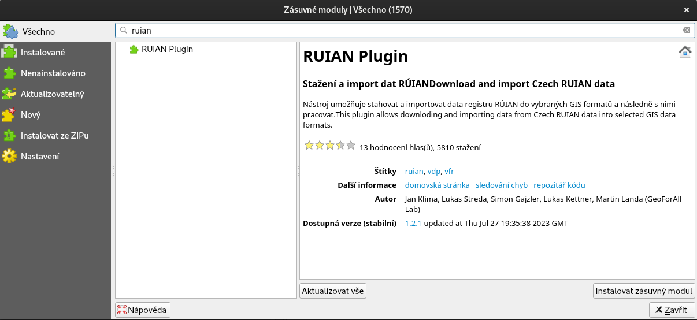
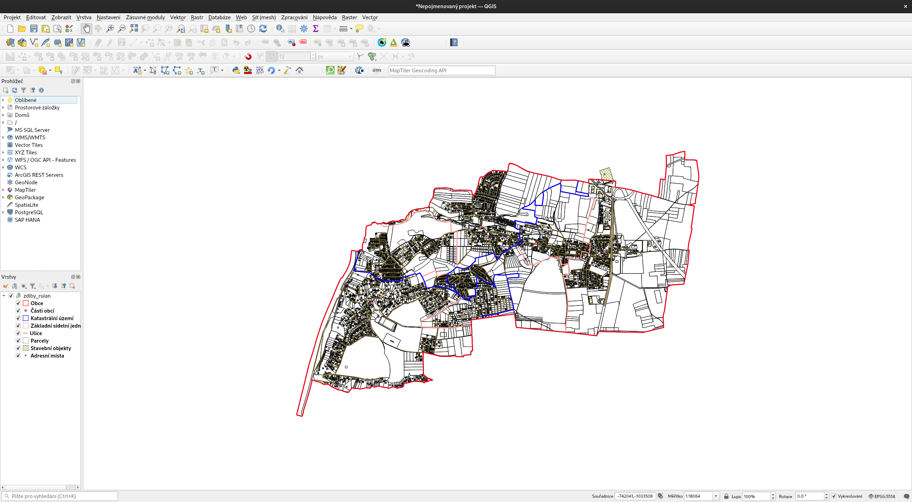
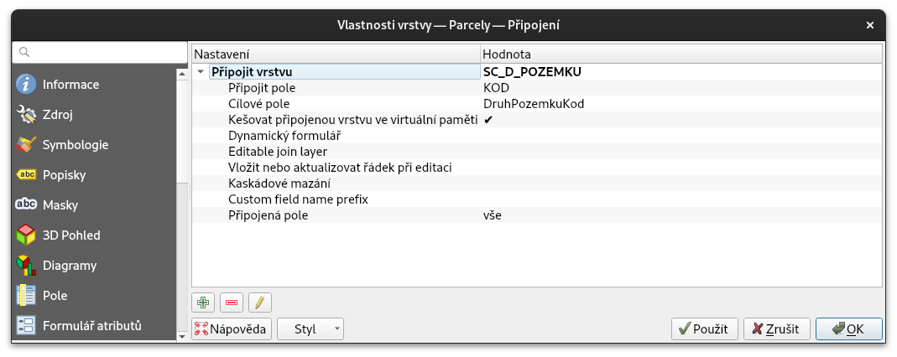
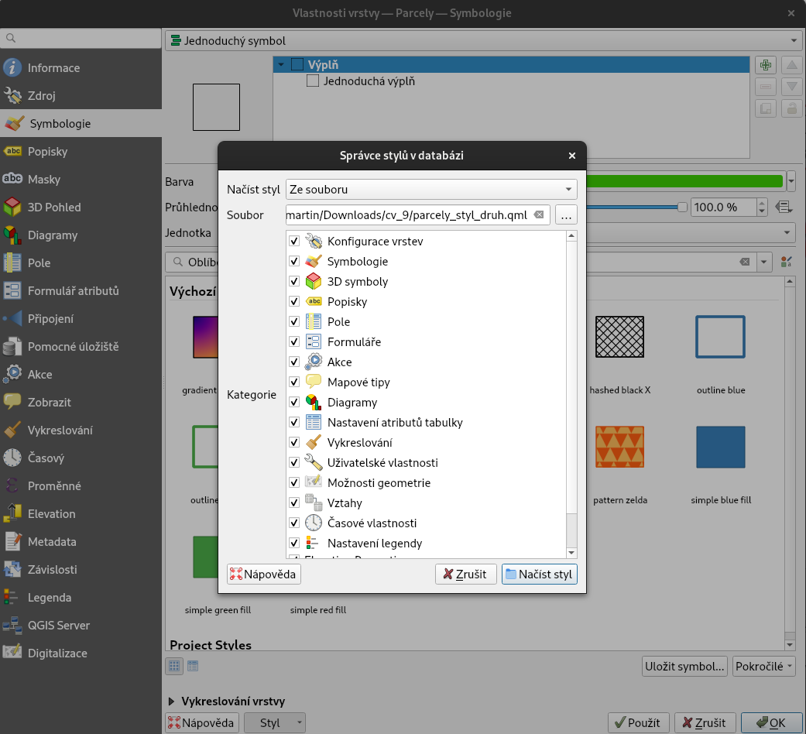
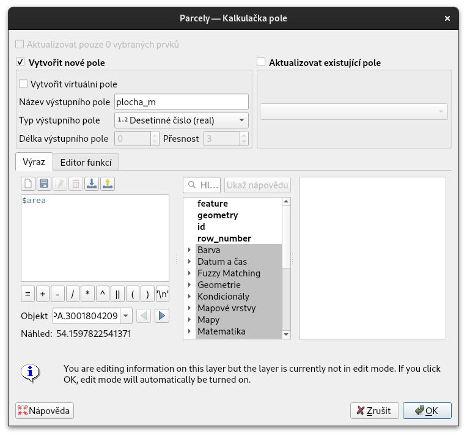
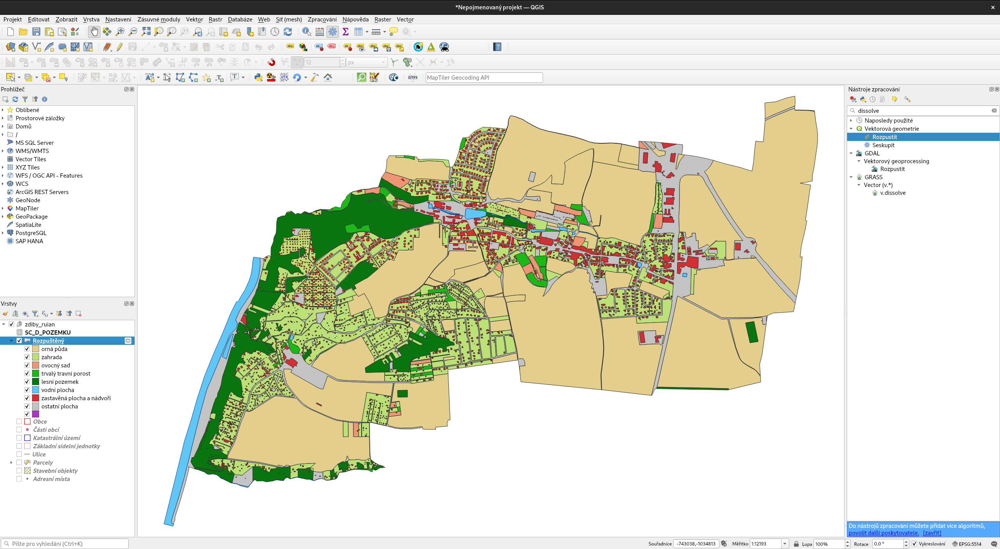
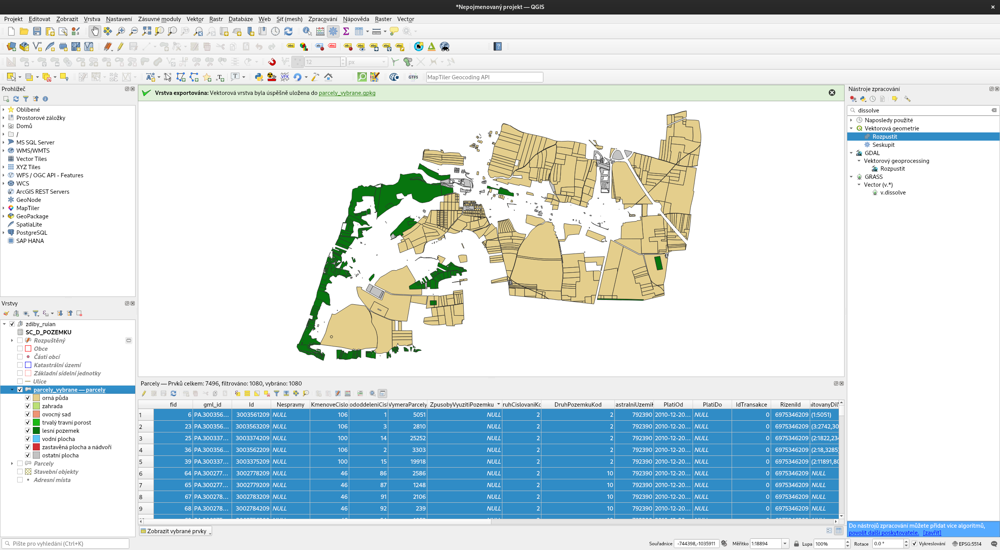
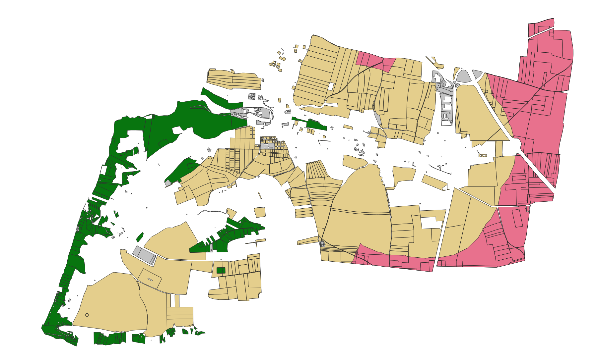

# Volně dostupné GIS nástroje (QGIS)

## Cíl cvičení

Seznámit se s volně dostupnými (open source) GIS nástroji. V praktické
rovině je prezentován [QGIS](https://qgis.org).

## Základní pojmy

- [**open
  source**](https://cs.wikipedia.org/wiki/Otev%C5%99en%C3%BD_software) –
  počítačový software s otevřeným zdrojovým kódem
- [**svobodný
  software**](https://cs.wikipedia.org/wiki/Svobodn%C3%BD_software) –
  software, který uživatelé mohou používat k libovolnému účelu,
  kopírovat, distribuovat, studovat a měnit
- [**OSGeo**](https://www.osgeo.org/) – nevládní nezisková organizace, jejímž cílem je podporovat a prosazovat společný vývoj otevřených geoinformačních technologií a dat
- [**QGIS**](https://qgis.org) – jeden z nejpoužívanějších open source GIS nástrojů v praxi

## Použité datové podklady

Cílem je používat data přímo od jejich poskytovatelů. Pro případ technických problémů je ale připraven balíček již připravených dat.

- [Data](https://geo.fsv.cvut.cz/vyuka/155gis1/geodata/gis1-cviceni09.zip)

Přehled dat, které budeme používat:

- balíček dat z RÚIAN pro jednu obec, budeme používat obec Zdiby. Pro kontrolu jednotlivých mezivýsledků doporučujeme použít totožnou obec. Stáhneme jako součást obsahu cvičení pomocí pluginu v QGIS.
- [číselník druhu pozemku](https://services.cuzk.cz/sestavy/cis/SC_D_POZEMKU.zip) – tabulka obsahující kódové hodnoty existujících druhů pozemku spolu s jejich textovým popisem a dalšími informacemi ve formátu CSV. Stáhnout jako běžný soubor.
- připravený styl pro *parcely* formou souboru ``parcely_styl_druh.qml``


## Náplň cvičení

Jako podpůrný materiál budeme používat školící materiály [QGIS pro
začátečníky](https://gismentors.github.io/qgis-zacatecnik) skupiny
[GISMentors](https://gismentors.cz).

### Načtení vstupních dat

Podklady:

- [přídání a export
  dat](https://gismentors.github.io/qgis-zacatecnik/vektorova_data/vektor_import.html#pridani-a-export-dat),
- [data s oddělenými
  hodnotami](https://gismentors.github.io/qgis-zacatecnik/vektorova_data/import_delim.html#import-dat)
  (pozor na datové typy - přetažení vs formulář)

Otevřeme QGIS a nainstalujeme plugin pro data z RÚIAN. V menu `Zásuvné moduly > Správa a instalace Zásuvných modulů` najdeme na základě klíčového slova "ruian" hledaný plugin a nainstalujeme jej `Instalovat zásuvný modul`:
    


Následně stáhneme data pro obec Zdiby a výstup uložíme do souboru ``zdiby_ruian.gpkg``:


    
Po potvrzení nastavení v dialogovém okně se data stáhnou a následně se rovnou i načtou do mapového okna:



Následně si stáhneme data číselníku druhu pozemku a načteme je do QGISu jako tabulková data bez geometrie. Doporučujeme data načíst namísto prostého přetažení pomocí dialogu `Vrstva > Správce zdrojů dat`. V tomto případě se korektně nastaví datové typy sloupců. Kódování znaků nastavíme na `windows-1250`:
    


  
### Připojení tabulkových dat

Podklady: [Postup
připojení dat](https://gismentors.github.io/qgis-zacatecnik/vektorova_data/join.html#postup-pripojeni)
 
Připojíme tabulku s druhy pozemků k polygonové vrstvě *parcely*. Propojení je možné nastavit na základě atributu s kódem druhu pozemku. Ten se jmenuje ``KOD`` a``DruhPozemkuKod``. Přípojení nastavíme v ve vlastnostech vrstvy *parcely*:




### Nastavení stylu

Podklady:

- [Nastavení stylu](https://gismentors.github.io/qgis-zacatecnik/vektorova_data/vektor_data_prace.html#styl)
- [Ukládání stylování do souboru](https://gismentors.github.io/qgis-zacatecnik/vektorova_data/vektor_data_prace.html#ulozeni-a-nacteni-nastaveni-vrstvy-pomoci-souboru)

Nastavíme symbologii pro *parcely* na základě druhu pozemku.
Styl je možné také sdílet s konkrétním nastavením. Vlastní vytvořený styl si uložíme do samostatného souboru.
Pro opačný postup použijeme již připravený styl pro vrstvu *parcely*, který lze načíst ze souboru ``parcely_styl.qmd``.




!!! task-fg-color "Otázka"

    Je spolehlivější sdílet styl založený na původním atributu, anebo na připojeném? 


### Výpočet plochy a její použití

Podklady:

- [Kalkulátor polí](https://gismentors.github.io/qgis-zacatecnik/vektorova_data/editace.html#kalkulator-poli)
- [Prostorové analýzy](https://gismentors.github.io/qgis-zacatecnik/vektorova_data/prostorove_analyzy.html)
- [Dissolve](https://gismentors.github.io/qgis-zacatecnik/vektorova_data/prostorove_analyzy.html#rozpustit-dissolve)

Dalším běžným úkolem je výpočet statistických údajů. Jedním z nejzákladnějších požadavků je práce s úrčováním plochy/výměry.
Zadáním je určit podíl jednotlivých druhů pozemků podle jejich výměry pro jednotlivá katastrální území.
Prvním krokem je spočítat plochu záznamům ve vrstvě *parcely* do atributu s názvem ``plocha_m `` pomocí *KALKULÁTORU POLÍ*.



!!! task-fg-color "Otázka"

    Jaký je rozdíl mezi výměrou v datech o parcelách a tou spočtenou přímo z geometrie?

Druhým krokem je sloučit parcely v jednotlivých katastrálních územích podle jejich druhu. Použijeme nástroj pro sloučení geometrii, kde je možné použít podmínku - *DISSOLVE*. Pole ``DruhPozemkuKod `` a ``KatastralniUzemiKod `` nastavíme jako parametry.



Pro aktualizaci plochy v atributu ``plocha_m `` použijeme nástroj aktualizace v atributové tabulce.


Výsledná data popisují dobře hodnoty, ale jejich uspořádání není vhodné na jednoduché zpracování.

!!! tip "Alternativní postup"

    Druhý krok můžeme provést i za pomocí dotazu v *DB manageru*, kde si nejdříve musíme připojit ``zdiby_ruian.gpkg`` jako databázové připojení.

    Pro rozložení do jednotlivých kroků může tato úloha vypadat následovně:

    - ```SELECT DruhPozemkuKod, KatastralniUzemiKod, plocha_m FROM parcely```
    - ```SELECT DruhPozemkuKod, KatastralniUzemiKod, sum(plocha_m) FROM parcely group by DruhPozemkuKod, KatastralniUzemiKod```
    - ```SELECT DruhPozemkuKod, KatastralniUzemiKod, sum(CASE WHEN DruhPozemkuKod=2 THEN plocha_m END) DruhPozemkuKod_2 FROM parcely group by DruhPozemkuKod, KatastralniUzemiKod```  + ostatní kategorie dle druhu pozemku

    
    
    Výslednou vrstvu lze uložit jako samostatný výsledek a připojit k vrstvě *katastralniuzemi*. Pro tuto lze par vykreslit jednotlivé diagramy spočtených kategorií.
    
    Podklady:

    - [Kartodiagramy](https://gismentors.github.io/qgis-pokrocily/ruzne/grafy.html#zalozka-diagramdiagramy)


## Simulace výběru pozemků pro fotovoltaické elektrárny

Zjednodušeně si vyzkoušíme malou část takovéhoto postupu.
Jedna část definuje výběr podle druhu pozemku. Druhá pak odstraní části parcel, které jsou v příliš malé vzdálenosti od vybraných typů stavebních objektů.

### Výběr parcel

Podklady:

- [Atributové dotazování](https://gismentors.github.io/qgis-zacatecnik/vektorova_data/dotazovani.html#atributove-dotazovani)

Parcely lze vybrat na základě druhu pozemku a způsobu využití.
Nás zajímají parcely podle následující definice:

- `DruhPozemkuKod` může nabývat hodnoty 2,8,10,14 (viz tabulka *SC_D_POZEMKU*)
- `ZpusobyVyuzitiPozemku` může nabývat hodnoty  2,3,4,5,26 (viz tabulka [SC_ZP_VYUZITI_POZ](https://www.cuzk.cz/Katastr-nemovitosti/Poskytovani-udaju-z-KN/Ciselniky-ISKN/Ciselniky-k-nemovitosti/Zpusob-vyuziti-pozemku.aspx)). Pozor, tam kde je NULL hodnota, je pro nás také relevantní.


Vybrané parcely uložíme jako mezivýsledek do nové vrstvy.



### Okolí budov

Podklady:

- [Obalová zóna dle pevné vzdálenosti (buffer)](https://gismentors.github.io/qgis-zacatecnik/vektorova_data/prostorove_analyzy.html#obalova-zona-dle-pevne-vzdalenosti-buffer)
- [Rozdíl (difference)](https://gismentors.github.io/qgis-zacatecnik/vektorova_data/prostorove_analyzy.html#rozdil-difference)

V odstupové vzdálenosti 500 m od určitých stavebních objektů nelze nic realizovat. 

Vybereme stavební objekty podle způsobu jejich využití, kterých se toto omezení týká - `ZpusobVyuzitiKod` nabývá hodnoty 2,6,7,8 (viz tabulka [SC_ZP_VYUZITI_BUD](https://www.cuzk.cz/Katastr-nemovitosti/Poskytovani-udaju-z-KN/Ciselniky-ISKN/Ciselniky-k-nemovitosti/Zpusob-vyuziti-stavby.aspx)).

Kolem vybraných budov pomocí funkce *BUFFER* obalovou zónu o velikosti 500 m. 

Následně potřebujeme ořezat vybrané parcely ořezat vytvořenou obalovou zónou budov. Pro tento krok použijeme funkci *DIFFERENCE*.


