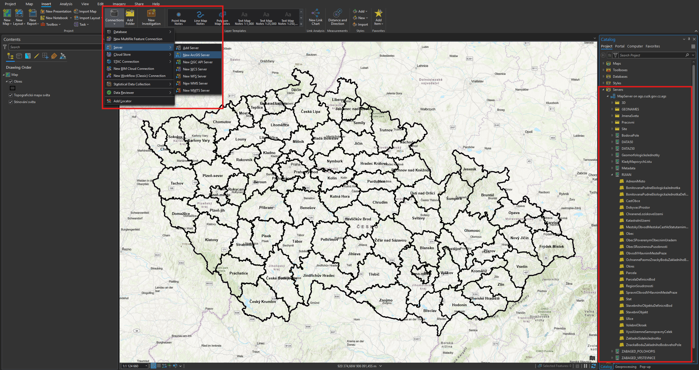

# Data

[ČÚZK ArcGIS REST server **POLOHOPIS** – stahovací služba](https://ags.cuzk.cz/arcgis/rest/services)

[ČÚZK ArcGIS REST server **VÝŠKOPIS** – stahovací služba](https://ags.cuzk.cz/arcgis2/rest/services)

## [ArcČR 500](https://www.arcgis.com/home/item.html?id=527cdeb48a8b4456a00ed4b35cbed799 "Odkaz na stažení")

ArcČR 500 je digitální vektorová geografická databáze České republiky, zpracována na úrovni podrobnosti 1 : 500 000. Navazuje na podobné databáze, zpracované firmou Esri. Obsahem databáze jsou přehledné geografické informace o ČR. Data umožňují široké spektrum prostorových analýz a vizualizace a poskytují možnost propojení na statistická data.

## [Císařské otisky stabilního katastru](<https://geoportal.cuzk.cz/(S(1v4m40zfva0uax45kgek0z45))/default.aspx?mode=TextMeta&side=dSady_archiv&metadataID=CZ-CUZK-COC-R&menu=2901> "Odkaz na stažení")

Jedná se o mapy z let 1826-1843, původně určené k archivaci v Centrálním archivu pozemkového katastru ve Vídni, odkud byly po vzniku Československé republiky v rámci archivní rozluky předány do Prahy. Na rozdíl od tzv. originálních map stabilního katastru zachycují původní stav krajiny bez dodatečného zákresu pozdějších změn. Dodnes patří ze strany badatelů k nejžádanějším a nejvyužívanějším archiváliím ÚAZK. Pro území Čech je archivováno cca 8400 katastrálních map na cca 31 tisících mapových listech. V katastrálních územích, pro která se tyto mapy nedochovaly, jsou postupně nahrazovány originálními mapami stabilního katastru.

## [Státní mapa 1 : 5 000 – odvozená](https://geoportal.cuzk.cz/(S(be3r4r2uzrecpufzskg2ngre))/Default.aspx?mode=TextMeta&side=dSady_archiv&metadataID=CZ-CUZK-SMO5-R&head_tab=sekce-02-gp&menu=2905> "Odkaz na stažení")

Státní mapa 1 : 5 000 – odvozená, vydávaná postupně od roku 1950, byla zamýšlena jako provizorium. Pro první vydání byl polohopis odvozen z katastrálních map a výškopis z nejvhodnějších existujících podkladů, například z topografických map v systému S-1952, v případě nezbytnosti i z topografických sekcí 3. vojenského mapování. Polohopis zobrazoval sídla, dopravní síť, vodstvo, lesy, správní hranice a značkami místopisné podrobnosti, jako jsou mosty, kříže, sochy, komíny, věže apod., vše v šedé barvě. Výškopis byl znázorněn vrstevnicemi v závislosti na použitých výškopisných podkladech, výškovými kótami a podle potřeby technickým nebo topografickým šrafováním včetně popisu v barvě hnědé. Grafické provedení mapového rámu se v průběhu vydávání map lišilo, u prvního vydání jsou na jednoduchém přímkovém rámu vyznačeny rysky rovinné souřadnicové sítě Křovákova zobrazení v půlkilometrovém intervalu. Až do roku 1990 tyto mapy nebyly určeny veřejnosti, ale směly se používat pouze pro vnitřní potřebu státních orgánů a socialistických organizací. Do produktu jsou zařazovány kromě skenů postupných vydání Státní mapy 1 : 5 000 – odvozené i skeny mladších map neodvozených (zdroj: ČÚZK).

## [DMR 5G](<https://geoportal.cuzk.cz/(S(dj1qcqtglm2rtdlklt1pblvm))/Default.aspx?lng=CZ&mode=TextMeta&side=vyskopis&metadataID=CZ-CUZK-DMR5G-V&mapid=8&menu=302> "Odkaz na stažení")

Digitální model reliéfu České republiky 5. generace (DMR 5G) představuje zobrazení přirozeného nebo lidskou činností upraveného zemského povrchu v digitálním tvaru ve formě výšek diskrétních bodů v nepravidelné trojúhelníkové síti (TIN) bodů o souřadnicích X,Y,H, kde H reprezentuje nadmořskou výšku ve výškovém referenčním systému Balt po vyrovnání (Bpv) s úplnou střední chybou výšky 0,18 m v odkrytém terénu a 0,3 m v zalesněném terénu. Model vznikl z dat pořízených metodou leteckého laserového skenování výškopisu území České republiky v letech 2009 až 2013. Dokončen byl k 30. 6. 2016 na celém území ČR. DMR 5G je určen k analýzám terénních poměrů lokálního charakteru a rozsahu, např. při projektování pozemkových úprav, plánování a projektování dopravních, vodohospodářských a pozemních staveb, modelování přírodních jevů lokálního charakteru, apod. DMR 5G je základní zdrojovou databází pro tvorbu vrstevnic určených pro mapy velkých měřítek a počítačové vizualizace výškopisu v územně orientovaných informačních systémech vysoké úrovně podrobnosti.

## [RÚIAN](https://vdp.cuzk.cz/vdp/ruian "Veřejný dálkový přístup k datům RÚIAN")

Registr územní identifikace, adres a nemovitostí (RÚIAN) je jedním ze základních registrů veřejné správy. Je veřejným seznamem, nevede žádné osobní údaje a je jedinečným zdrojem adres nejen pro veřejnou správu. Obsahuje také údaje o územních prvcích, územně evidenčních jednotkách a jejich vzájemných vazbách.

**Připojení dat RÚIAN do ArcGIS Pro**

Z Map Serveru ČÚZK se zkopíruje odkaz k Prohlížecí a vyhledávací službě nad daty RUIAN ČR.

[Prohlížecí služba nad daty RÚIAN :simple-databricks:](https://ags.cuzk.gov.cz/arcgis/rest/services/RUIAN/MapServer){ .md-button .md-button--primary }
{: .button_array}

Připojení služby do ArcGIS Pro proběhne přes tlačítko _:material-button-cursor: Connections_{: .outlined_code} v záložce _:material-tab: Insert_{: .outlined_code} v horní části programu. Po rozkliknutí nabídky se zvolí _:material-form-dropdown: Server_{: .outlined_code} → _:material-form-dropdown: New ArcGIS Server_{: .outlined_code}. 

Do *Server URL* se zkopíruje adresa služby ```https://ags.cuzk.gov.cz/arcgis/rest/services/RUIAN/MapServer```.

V záložce _:material-tab: Catalog_{: .outlined_code} se zobrazí nově připojený server s daty z ČÚZK. Vrstvy RÚIAN nalezneme v příslušné složce.

<figure markdown>

    <figcaption>Import dat RÚIAN a jejich nalezení v záložce Catalog</figcaption>
</figure>

Pokud chceme vybrat pouze část dat, které je potřeba exportovat do samostatné vrstvy (např. pouze jednu obec), pak vybereme požadovaný rozsah dat a do nové vrstvy je vyexportujeme funkcí _Select_{: .outlined_code}. Ta se ukrývá v záložce _Geoprocessing_{: .outlined_code}. 

Pozor - neplést s výběrem prvků _Select :fontawesome-solid-arrow-pointer:_{: .outlined_code}.


## [Data250](https://geoportal.cuzk.cz/(S(htwtba15ms3bpwjajv0aqpxq))/Default.aspx?mode=TextMeta&side=mapy_data250&text=dSady_mapyData250 "Databáze Data250")
Databáze Data250 je digitální geografický model území České republiky odpovídající přesností a stupněm generalizace měřítku 1:250 000. Data250 je zpracována v rozsahu celého území České republiky, vznikla generalizací původní databáze Data200 v roce 2023.

Aktuální vydání Data250 obsahuje cca 50 typů objektů. Data zahrnují osm tematických oblastí – hranice, vodstvo, popis, sídla, doprava, vegetace, reliéf a různé objekty. Souborová data produktu Data250 jsou poskytována stahovacími službami ATOM jako otevřená data, bezplatně, na základě licence Creative Commons CC BY 4.0.

## [Data200](https://geoportal.cuzk.cz/(S(htwtba15ms3bpwjajv0aqpxq))/Default.aspx?mode=TextMeta&side=mapy_data200&text=dSady_mapyData200 "Databáze Data200")
Databáze Data200 je digitální geografický model území České republiky (ČR) odpovídající přesností a stupněm generalizace měřítku 1:200 000. Data200 je zpracována v rozsahu celého území České republiky, vznikla na základě projektu EuroRegionalMap (ERM) evropského sdružení civilních zeměměřických a mapových služeb EuroGeographics. Zpracování ERM za Českou republiku zajišťuje Zeměměřický úřad od roku 2005.

Databáze Data200 vychází z ERM a rozšiřuje ji o další objekty. Aktuální vydání Data200 obsahuje cca 50 typů objektů. Data zahrnují osm tematických oblastí – hranice, vodstvo, popis, sídla, doprava, vegetace, reliéf a různé objekty. Díky svému původu jsou tato data homogenní v rámci Evropy a vystykovaná na státních hranicích, takže je lze kombinovat s daty ERM ostatních států a získat tak kvalitní podklad pro řešení nejen národních, ale i různých přeshraničních projektů.

V Zeměměřickém úřadu tato databáze slouží jako zdroj pro tvorbu kartografických výstupů odpovídajícího měřítka a pro aktualizaci tematických nadstaveb včetně ERM. Data200 jsou od dubna 2019 poskytována jako otevřená data ve formátu SHP.

## [Data50](https://geoportal.cuzk.cz/(S(htwtba15ms3bpwjajv0aqpxq))/Default.aspx?mode=TextMeta&side=mapy_data50&text=dSady_mapyData50 "Databáze Data50")
Data50 je digitální geografický model území České republiky odvozený z kartografické databáze pro Základní mapu ČR 1 : 50 000. Souborová data SHP tvoří 59 typů geografických objektů. Data zahrnují osm tematických oblastí sídelní, kulturní a hospodářské objekty, komunikace, produktovody a elektrické vedení, vodstvo, hranice územních jednotek, vegetace a povrch, terénní reliéf a popis. Souborová data produktu Data50 jsou poskytována stahovacími službami ATOM jako otevřená data, bezplatně, na základě licence Creative Commons CC BY 4.0.

## [ZABAGED (polohopis)](https://geoportal.cuzk.cz/(S(4d3ixwvvpejhs0flnqsgbbbh))/default.aspx?mode=TextMeta&text=dSady_zabaged&side=zabaged&menu=24 "Základní báze geografických dat České republiky - polohopis")
Základní báze geografických dat České republiky (ZABAGED®) je vektorový geografický digitální model území České republiky (ČR), který je spravován Zeměměřickým úřadem ve veřejném zájmu. ZABAGED® je součástí informačního systému zeměměřictví podle zákona č. 200/1994 Sb., o zeměměřictví a o změně a doplnění některých zákonů souvisejících s jeho zavedením, ve znění pozdějších předpisů (dále jen „zákon o zeměměřictví“). Obsah a předmět správy ZABAGED® je dán vyhláškou č. 31/1995 Sb., kterou se provádí zákon o zeměměřictví. Souborová data ZABAGED® jsou od 1. 7. 2023 poskytována ve vybraných formátech stahovacími službami ATOM jako otevřená data, bezplatně na základě licence Creative Commons CC BY 4.0.

## [OpenStreetMap](https://download.geofabrik.de/europe/czech-republic.html "Data OSM pro ČR")
OpenStreetMap je projekt, jehož cílem je tvorba volně dostupných geografických dat a následně jejich vizualizace do podoby topografických map (např. silniční mapa, turistická mapa, cyklomapa a navigování v nich). Pro tvorbu geodat se jako podklad využívá záznamů z přijímačů globálního družicového polohového systému nebo jiné zpravidla digitalizované mapy, která jsou licenčně kompatibilní. Projekt byl založen v roce 2004 a využívá kolektivní spolupráce spolu s koncepcí Otevřeného software. Data jsou poskytována pod licencí Open Database License.

???+ note "&nbsp;<span style="color:#448aff">How to: Download OSM data</span>"
    **1.**  **Přímo z OSM**

    První metodou je stažení přímo z webových stránek OpenStreetMap pomocí jejich exportéru. Jednoduše přejděte na stránku [OSM](www.openstreetmap.org) a najděte oblast, pro kterou chcete stáhnout data. Stiskněte tlačítko *Export* a můžete ručně vybrat požadovanou oblast podle ohraničení. Poté si můžete stáhnout soubor ve formátu .osm. Při práci v aplikaci ArcGIS Pro je třeba stáhnout a nainstalovat speciální rozšíření *Data Interoperability*, které není součástí standardního balíčku a vyžaduje zvláštní licenci od koordinátora licencí pro danou lokalitu.

    [<span>openstreetmap.org</span><br>OSM](https://www.openstreetmap.org){ .md-button .md-button--primary .server_name .external_link_icon_small target="_blank"}
    {: .button_array}

    **2.**  **Geofabrik**

    Tento server obsahuje připravené extrakty dat z projektu OpenStreetMap, které jsou obvykle aktualizovány každý den. V nabídce vyberte svůj kontinent a poté zemi, která vás zajímá. Tuto službu stahování otevřených dat nabízí společnost Geofabrik GmbH zdarma.

    [<span>http://download.geofabrik.de/</span><br>Geofabrik](http://download.geofabrik.de/){ .md-button .md-button--primary .server_name .external_link_icon_small target="_blank"}
    {: .button_array}

    **3.** **Overpass Turbo**

    Jedná se o webový nástroj pro filtrování a stahování dat OSM. Pomocí **overpass turbo** můžete spouštět dotazy *Overpass API* a výsledná data OSM interaktivně analyzovat v mapě. K dispozici je integrovaný *Wizard*, který usnadňuje vytváření dotazů a přípravu dat pro stažení.

    [<span>https://overpass-turbo.eu/</span><br>OverpassTurbo](https://overpass-turbo.eu/){ .md-button .md-button--primary .server_name .external_link_icon_small target="_blank"}
    {: .button_array}

    *ukázková query 1: najdi všechny výškové kóty v bounding boxu*

        [out:json];
        node[natural=peak]({{bbox}});
        out body;

    *ukázková query 2: najdi všechny železniční zastávky v Praze*

        area[name="Praha"];
        nwr(area)[railway=station];
        out;

    **4.** **BBBike**

    BBBike extrahuje umožňuje extrahovat data z OSM dle zadané oblasti ve formátu OSM, PBF, o5m, Garmin, Organic Maps, mbtiles, OsmAnd, Esri shapefile, mapsforge, OPL, GeoJSON, SQLite, text nebo CSV. Maximální velikost oblasti je 24 000 000 km2 nebo velikost souboru 1500 MB a vytvoření oblasti trvá cca 5 minut.

    [<span>https://extract.bbbike.org//</span><br>BBBike](https://extract.bbbike.org/){ .md-button .md-button--primary .server_name .external_link_icon_small target="_blank"}
    {: .button_array}

    Jak používat službu BBBike:

    -   přesuňte mapu na požadované místo

    -   kliknutím vytvoříte ohraničení zájmové oblasti

    -   vyberte formát, zadejte svou e-mailovou adresu a název oblasti, kterou chcete extrahovat

    -   klikněte na tlačítko extrahovat. Počkejte na oznámení e-mailem a stáhněte mapu

## [Veřejná databáze ČSÚ](https://vdb.czso.cz/vdbvo2/ " VDB ČSÚ")
Český statistický úřad (ČSÚ) je ústředním orgánem státní správy České republiky. Byl zřízen dne 8. ledna 1969 zákonem č. 2/1969 Sb., o zřízení ministerstev a jiných ústředních orgánů státní správy. Veřejná databáze ČSÚ (VDB) je úzce napojená na statistický metainformační systém ČSÚ, zejména na systém ukazatelů a číselníků. Každý údaj v databázi je identifikován z hlediska věcného, časového i územního a také odkazem na zdroj dat. ČSÚ rámci VDB tedy poskytuje demografická statistická data vztažená k různým úrovním administrativních jednotek ČR, které je možné zdarma stahovat a připojit do GIS.

## [Natural Earth](https://www.naturalearthdata.com/ "Natural Earth Data")
Natural Earth je veřejná mapová datová sada dostupná v měřítku 1:10 000 000, 1:50 000 000 a 1:110 000 000. K dispozici jsou pro každé měřítko vektorová (kategorie Physical a Cultural) a rastrová data. Databáze Natural Earth byla vybudována ve spolupráci mnoha dobrovolníků, je podporována NACIS (North American Cartographic Information Society) a lze zdarma použít v jakémkoli typu projektu.
