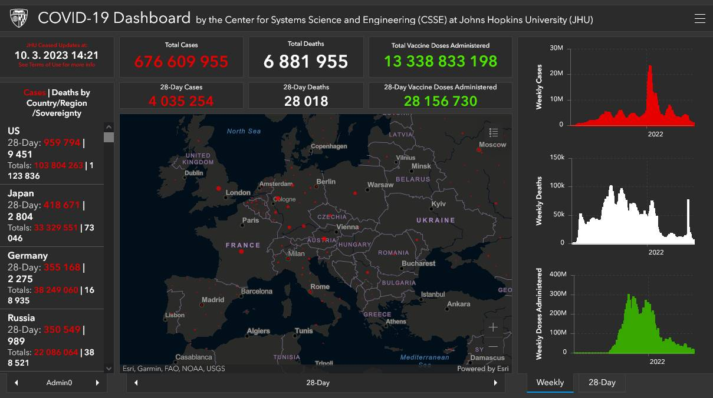
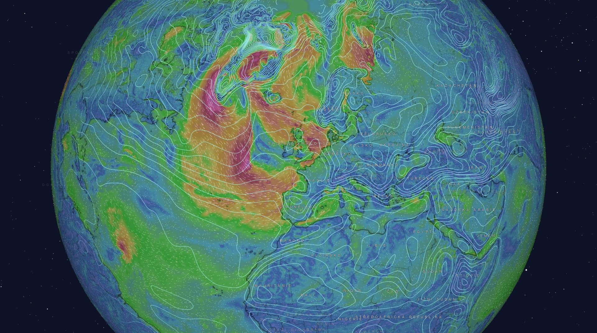
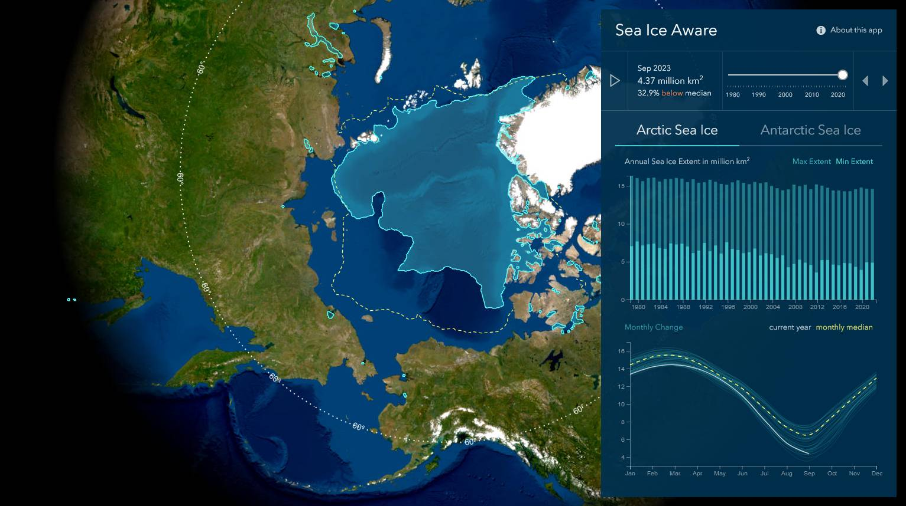
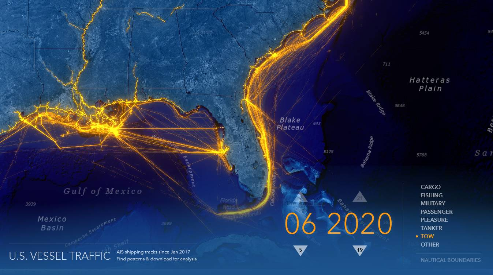
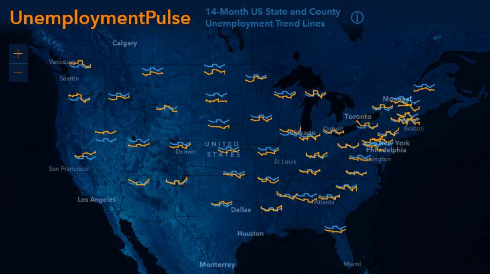
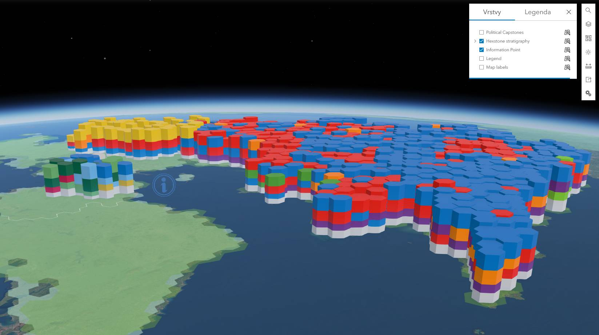
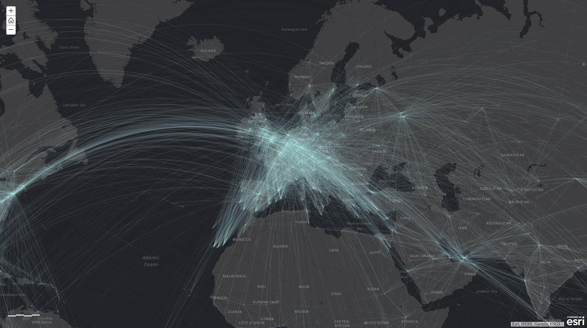

# GIS 1 {: .page_title}

Předmět vás seznámí se základy tzv. __geografických informačních systémů__ (GIS). GIS je soubor nástrojů sloužících ke __sběru__, __správě__, __analýze__ a __vizualizaci__ geografických dat. Umožňuje efektivně pracovat s prostorovými informacemi, což zahrnuje __mapy__, __satelitní snímky__, __adresy__, __topografické údaje__ a mnoho dalšího. Dokáže provádět složité analýzy, identifikovat vzory, a tím __lépe porozumět geografickým jevům a vztahům__.

GIS má široké uplatnění, od __městského plánování__, přes __správu přírodních zdrojů__ až po __krizový management__. Je nepostradatelným nástrojem pro efektivní rozhodování a řízení v různých odvětvích a pomáhá lépe pochopit složité geografické souvislosti.

GIS 1 je v tomto tématu úvodním kurzem. Zatímco přednášky vás provedou základní teorií, cvičení se věnují praktickému ovládání GIS software – zejména porozumění práce s daty a provádění jednodušších analýz. Během výuky je používán software __:simple-arcgis: Esri ArcGIS Pro__{: style="white-space: nowrap;"}, ke konci kurzu bude pak věnován prostor i možným alternativám (program __:simple-qgis: QGIS__).

<h2 style="text-align:center;">Naučíte se</h2>
<!-- styl je zde pridany HTML tagem (ne pomoci '##'), aby se text neobjevil v tabulce obsahu vlevo na strance -->

 <!-- specificky format gridu (trida "grid_icon_info") na miru uvodni strance predmetu -->

-   :material-map-outline:{ .xl }

    __zpracovávat__ a __analyzovat__ prostorová (tj. geografická, mapová) data

-   :material-vector-polygon:{ .xl }

    porozumět rozdílu mezi __vektorovými__ a __rastrovými__ daty

-   :material-filter-outline:{ .xl }

    __filtrovat__ data pomocí atributových a prostorových dotazů

-   :material-tools:{ .xl }

    aplikovat základní __prostorové funkce__ (nástroje geoprocessingu)

-   :material-creation-outline:{ .xl }

    __tvořit__ a __editovat__ GIS data

-   :material-vector-difference:{ .xl }

    základy datové __topologie__

-   :octicons-share-16:{ .xl }

    __sdílet__ data prostřednictvím webu (systém _ArcGIS Online_, webové mapové aplikace)

-   :simple-qgis:{ .xl }

    získat základy ovládání __alternativního GIS software__ (_QGIS_)

{: .no-filter }
{: .no-filter }
{: .no-filter }
{: .no-filter }
{: .no-filter }
{: .no-filter }
{: .no-filter }
{: .no-filter }
{: .no-filter }
{: .no-filter }
{: .no-filter }
{: .no-filter }

<!-- ## Doporučená literatura

1. Kolář, J.: Geografické informační systémy 10. Vydavatelství ČVUT, Praha 1998.
2. Rapant, P. (2006): Geoinformatika a geoinformační technologie. VŠB-TU Ostrava, 500 str. ISBN 80-248-1264-9.
3. Břehovský, M., Jedlička, K. (2005): Přednáškové texty pro Úvod do GIS. ZČU Plzeň, 116 s.
4. Hrubý M.: Geografické Informační Systémy (GIS) - Studijní opora. VÚT v Brně, 91 str.
5. Tuček J.: Geografické informační systémy, Praha Computer Press, 1998. -->

## Přednášky {: style="margin-bottom:0;"}

účast doporučená
{: style="opacity:50%;margin-top:0;"}

{: .off-glb .no-filter style="height: 1.5em; vertical-align: -.4em; clip-path: circle();"} 
__prof. Ing. Lena Halounová, CSc.__

1. Definice GIS, informatika, základní pojmy, aplikační oblasti GIS, prostor, topologie, historie GIS
2. Reálný svět × GIS, model v GIS, vztahy objektů, typy modelů, geometrické typy objektů, rozlišovací schopnost
3. Geografická poloha v GIS, prostorové vztahy, atributy
4. Čas v GIS, modelování, druhy modelů, chyby v modelování v GIS
5. Vektorový a rastrový GIS, datová struktura
6. Rastrový GIS, atributová data
7. Vektorový GIS, druhy objektů
8. Geometrické a topologické vlastnosti objektů ve vektorovém GIS
9. Vektorová a rastrová reprezentace prostorových objektů
10. Rastrová reprezentace prostorových objektů, způsob ukládání rastrových objektů

## Harmonogram {: style="margin-bottom:0;"}

[{.off-glb .no-filter}](https://kos.cvut.cz/schedule/course/1551GIS/semester/B232){target="_blank"}
[{.off-glb .no-filter}](https://kos.cvut.cz/schedule/course/1551GIS/semester/B232){target="_blank"}

---

[Stránka předmětu v :custom-kos-logo-img-BW:{.middle style="margin-left:3px;"} :custom-kos-logo-BW:{.xl .middle}](https://kos.cvut.cz/course-syllabus/1551GIS/B232){ .md-button .md-button--primary target="_blank"}
{align=center}

 
